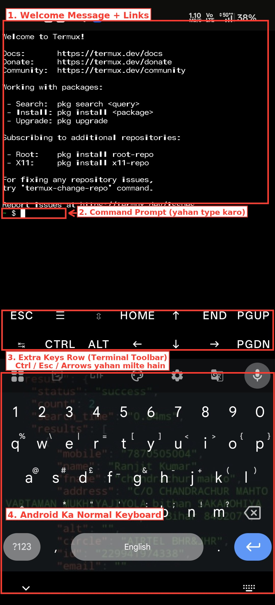
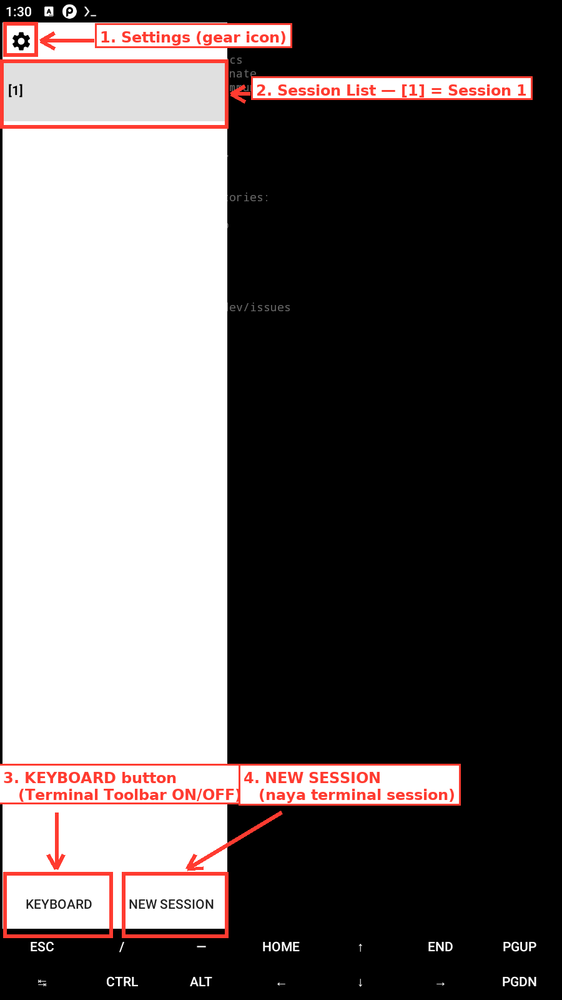
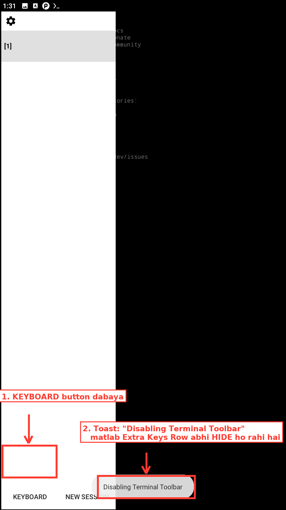

# Chapter 6 — Termux — Mobile Hacker Ka Setup
### By TWH (Afsar Ali) | Technical White Hat

---

## 📚 Table of Contents

| # | Topic | Jump |
|---|---|---|
| 6.1 | Termux Kya Hai — Poori Kahani | [➜ Jao](#-topic-61--termux-kya-hai--poori-kahani) |
| 6.2 | Termux Install Karna — Sahi Tarika | [➜ Jao](#-topic-62--termux-install-karna--sahi-tarika) |
| 6.3 | Termux Open Karne Ke Baad — Screen Tour | [➜ Jao](#-topic-63--termux-open-karne-ke-baad--screen-tour) |
| 6.4 | Update aur Upgrade — pkg Ki Pehli Command | [➜ Jao](#-topic-64--update-aur-upgrade--pkg-ki-pehli-command) |
| 6.5 | Storage Setup — Phone Ki Files Tak Pahunchna | [➜ Jao](#-topic-65--storage-setup--phone-ki-files-tak-pahunchna) |
| 6.6 | Repository/Mirror Kya Hai — Kyun aur Kab Change Karna Padta Hai | [➜ Jao](#-topic-66--repositorymirror-kya-hai--kyun-aur-kab-change-karna-padta-hai) |
| 6.7 | Package Management Poora — pkg Se Sab Kuch | [➜ Jao](#-topic-67--package-management-poora--pkg-se-sab-kuch) |
| 6.8 | Terminal Navigation Termux Mein | [➜ Jao](#-topic-68--terminal-navigation-termux-mein) |
| 6.9 | Termux Ka Environment — Sandbox, PREFIX, HOME | [➜ Jao](#-topic-69--termux-ka-environment--sandbox-prefix-home) |
| 6.10 | Shell Config — .bashrc, PATH, Aliases | [➜ Jao](#-topic-610--shell-config--bashrc-path-aliases) |
| 6.11 | Text Editors Termux Mein — nano aur vim | [➜ Jao](#-topic-611--text-editors-termux-mein--nano-aur-vim) |
| 6.12 | Termux vs Kali Linux — Poora Comparison | [➜ Jao](#-topic-612--termux-vs-kali-linux--poora-comparison) |
| 6.13 | Common Problems — Khud Solve Karna Seekho | [➜ Jao](#-topic-613--common-problems--khud-solve-karna-seekho) |

---
---

so Chapter 6 mein aapka welcome hai — **Termux.**

is chapter mein hum seekhenge ki **sirf apne Android phone ko use karke** hi hum hacking seekh sakte hain, practice kar sakte hain, aur real kaam bhi kar sakte hain — bina kisi PC ya laptop ke.

aur yeh chapter **kyun zaroori hai** — dono type ke audience ke liye — yeh samjho:

agar tumhare paas computer ya laptop hai, matlab tum Kali Linux use kar sakte ho, tab bhi yeh Termux tumhare liye important hai. kyun? kyunki **real life mein har jagah tumhare paas apna PC hona zaroori nahi hai** — office, college, safar, kahin bhi — lekin **mobile hamesha tumhare saath hota hai.** jo kaam PC bina nahi ho sakta tha, wahi kaam ab tumhare pocket mein hi ho sakta hai.

aur agar tumhare paas PC/laptop hai hi nahi, sirf phone hai — toh yeh chapter tumhare liye **sabse zaroori** hai, kyunki yehi tumhara asli hacking setup banega.

chalo, ek zaroori baat pehle clear kar lete hain —

---

### ek message un logo ke liye jo Chapter 5 complete karke aaye hain

agar tumne **Chapter 5 (Kali Linux)** poora complete kiya hai aur wahan se seedha yahan aaye ho — badhai ho, yeh chapter tumhare liye **kaafi aasan** hoga. jo commands, jo tareeka wahan seekha, unme se bahut kuch yahan **wahi ka wahi** kaam aayega — sirf ghar (environment) badlega.

aur agar tum ek **phone user** ho, jinke paas laptop nahi hai, aur tum **seedha isi chapter pe** aaye ho — koi tension mat lo. hum yahan **bilkul basic se** shuru karenge, jaise pehli baar kuch seekh rahe ho. tumhe kahin bhi atakna nahi padega.

toh chalo, shuru karte hain.

---
---

## 📌 Topic 6.1 — Termux Kya Hai — Poori Kahani

---

### ek sawaal se shuru karte hain

chapter 5 mein Kali Linux install karne ke liye kya chahiye tha? — ek laptop/PC, VirtualBox, aur GBs ka space.

ab socho — agar tumhare paas sirf ek **Android phone** hai. koi laptop nahi. kya tum phir bhi Linux ka terminal use kar sakte ho?

jawab hai — **haan.** aur uska naam hai **Termux.**

---

### Termux kya hai — seedhi baat

**Termux ek app hai** jo tumhare Android phone ke andar chalta hai, aur tumhe ek **real Linux command-line terminal** deta hai — bina phone root kiye, bina koi extra operating system install kiye.

ek baat yahin clear kar lo — yeh sabse zyada confuse karne wali cheez hai:

> **Termux khud ek operating system NAHI hai — jaisa Kali Linux hai.**

Kali Linux ek **poora alag OS** hai — usko tumne VirtualBox mein install kiya, usko boot kiya, uska apna poora system tha.

Termux ek **app** hai — jaise WhatsApp ya Instagram ek app hai — jo already chal rahe Android ke **andar** install hota hai aur chalta hai.

---

### toh phir yeh Linux jaisa kaam kaise karta hai?

yahi asli mazedaar baat hai — aur chapter 4 mein iska ek chhota sa hint diya gaya tha.

**Android khud Linux kernel pe bana hai.**

kernel = operating system ka woh sabse andar wala hissa jo hardware (CPU, RAM, storage) se seedha baat karta hai. Android jab banaya gaya tha, Google ne apna khud ka kernel nahi banaya — unhone **Linux kernel** liya aur uske upar Android ka apna layer (UI, apps, Play Store) chadha diya.

**Kali Linux bhi Linux kernel pe bana hai.** Kali ke upar Debian ka layer hai, terminal hai, hacking tools hain.

toh dono — Android aur Kali — ek hi "dada" (Linux kernel) ki santaan hain. upar ka ghar (UI, apps) alag hai, lekin niche ki nींव (foundation) same hai.

**isiliye Termux yeh kamaal kar paata hai:** kyunki phone ke andar already Linux kernel maujood hai, Termux ko apna naya kernel install karne ki zaroorat nahi padti. Termux sirf **upar ka Linux jaisa environment** (shell, commands, packages) bana deta hai jo seedha usi maujooda kernel se baat karta hai.

---

### ek analogy se pakka karo

socho Android phone ek **poora bana banaya ghar** hai — deewarein khadi hain, chhat lagi hai, sab kuch ready hai.

- **Kali Linux** = zameen se apna naya ghar banana. poori zameen, apni deewarein, apna structure — sab tumhara control.
- **Termux** = us already bane hue ghar (Android) ke **andar ek kamra kiraye pe lena.** us kamre mein tum apna table-kursi (Linux commands, tools) laga sakte ho, apna kaam kar sakte ho — lekin poore ghar (Android system) ke maalik tum nahi ho. bahar ki deewarein tum nahi tod sakte.

yehi wajah hai ki **Termux mein by default root access nahi milta** — tum ek kiraye ke kamre mein ho, poore ghar ke maalik nahi.

---

### Termux ka history — chhota sa

Termux ko **Fredrik Fornwall** naam ke developer ne banaya tha, aur yeh ek **open-source project** hai — matlab iska code publicly available hai, koi bhi dekh/contribute kar sakta hai. yeh Google ya Offensive Security jaisi kisi badi company ka product nahi hai — ek community-driven tool hai jo aaj lakhon mobile users use karte hain.

(chapter 4 mein yeh bhi bataya gaya tha — Termux Play Store pe outdated version mein milta hai, official aur updated version GitHub/F-Droid se lena chahiye. agle topic mein hum yeh dobara detail mein karenge.)

---

### Kali Linux vs Termux — kiske liye kya hai

| | Kali Linux | Termux |
|---|---|---|
| **kis pe chalta hai** | PC/Laptop (VM ya real install) | Android phone (app ke roop mein) |
| **kaisa hai** | poora alag operating system | Android ke andar chalne wala app |
| **root access** | full control, root by default | sandboxed, root nahi milta by default |
| **install kaise hota** | VirtualBox/dual boot mein poora OS | app install karke seedha khul jaata hai |
| **kiske liye best** | PC pe baithke deep kaam karne wale hackers | mobile/on-the-go, kahin bhi turant kaam karne wale |

dono ek hi Linux family ke member hain — bas ek poora ghar hai, doosra kiraye ka kamra.

---

### achhi khabar — chapter 5 wale commands yahan bhi kaam karenge

`ls`, `cd`, `mkdir`, `grep`, `|` (pipe), `sort` — yeh sab commands **Linux ke standard commands hain**, Kali ke apne nahi. isliye jo bhi tumne chapter 5 mein seekha, woh Termux mein bhi **waisa hi chalega.**

aur agar tum seedha yahan aaye ho, Kali dekhe bina — koi tension nahi. is poore chapter mein hum har command bilkul basic se, shuru se samjhayenge.

---

### ek line mein

> **Termux ek OS nahi, ek app hai jo Android ke andar Linux jaisa terminal deta hai — kyunki Android khud Linux kernel pe bana hai. Kali PC hackers ka poora ghar hai, Termux mobile hackers ka kiraye ka kamra — root nahi milta, lekin commands wahi Linux family ke hain.**

---

## 🧠 MCQ Set — Topic 6.1

---

**Q1.** Termux kya hai?

- A) Kali Linux ka mobile version jo Play Store pe milta hai
- B) ek website jo online hacking commands chalati hai
- C) ek app jo Android ke andar Linux jaisa terminal environment deta hai
- D) ek naya operating system jo phone ki jagah install hota hai

✅ **Sahi Jawab: C**
> Termux ek app hai, naya OS nahi — Android ke andar hi Linux-jaisa command-line environment deta hai.

---

**Q2.** Termux aur Kali Linux mein kya basic farak hai?

- A) Kali PC/laptop ke liye poora OS hai, Termux Android ke andar chalne wala app hai
- B) Termux Windows ke liye hai, Kali sirf Mac ke liye
- C) dono bilkul same cheez hain, sirf naam alag hai
- D) Kali sirf online chalta hai, Termux offline chalta hai

✅ **Sahi Jawab: A**
> Kali ek poora operating system hai jo alag se install hota hai. Termux ek app hai jo Android ke andar hi chalta hai.

---

**Q3.** Termux aur Android ke beech woh kaunsa connection hai jo Termux ko Linux jaisa banata hai?

- A) Termux khud apna alag kernel install karta hai phone mein
- B) Google ne Termux ko officially Android mein add kiya hai
- C) Termux phone ki RAM ko Linux mein convert kar deta hai
- D) Android ka core Linux kernel pe bana hai — Termux usi kernel se seedha baat karta hai

✅ **Sahi Jawab: D**
> Android bhi Linux kernel pe bana hai. Termux ko naya kernel nahi banana padta — woh sirf upar ka Linux-jaisa environment provide karta hai jo maujooda kernel se baat karta hai.

---

**Q4.** Termux mein by default root access milta hai?

- A) haan, install karte hi phone root ho jaata hai
- B) nahi, Termux ek sandboxed environment mein chalta hai — root nahi milta
- C) sirf Samsung phones mein root milta hai
- D) haan, lekin sirf premium version mein

✅ **Sahi Jawab: B**
> Termux ek "kiraye ka kamra" hai Android ghar ke andar — poore ghar (system) ka maalik nahi banta, isliye root by default nahi milta.

---

**Q5.** "Termux ek virtual machine hai jisme poora Kali Linux chalta hai" — yeh baat sahi hai ya galat?

- A) galat hai — Termux khud ek Linux userland environment hai, VM nahi
- B) sahi hai, Termux ke andar Kali hi chalta hai
- C) sahi hai, lekin sirf rooted phones mein
- D) galat hai, Termux asal mein Windows emulator hai

✅ **Sahi Jawab: A**
> Termux VM nahi hai, na hi Kali ka andar chalna zaroori hai. yeh khud ek independent Linux-jaisa environment hai.

---

**Q6.** Kali Linux kis type ke users ke liye zyada suited hai, aur Termux kis type ke liye?

- A) Kali sirf gamers ke liye, Termux sirf students ke liye
- B) dono sirf professional companies use karti hain
- C) Kali sirf beginners ke liye, Termux sirf experts ke liye
- D) Kali PC/laptop wale hackers ke liye, Termux mobile/on-the-go hackers ke liye

✅ **Sahi Jawab: D**
> Kali deep, PC-based kaam ke liye best hai. Termux tab kaam aata hai jab sirf phone available ho aur kahin bhi turant kuch karna ho.

---

**Q7.** agar chapter 5 (Kali) skip karke seedha Termux seekh rahe ho, toh kya hoga?

- A) Termux bilkul samajh nahi aayega bina Kali seekhe
- B) koi problem nahi — is chapter mein commands bilkul basic se dobara samjhaye jaayenge
- C) Termux install hi nahi hoga bina Kali ke
- D) sirf Kali seekhne walon ke liye hi Termux allowed hai

✅ **Sahi Jawab: B**
> Chapter 6 khud mein complete hai — har command basic se explain hoga, chahe tumne Kali dekha ho ya nahi.

---

**Q8.** Termux ki history ke baare mein kya sahi hai?

- A) Termux ko Google ne 2010 mein banaya tha
- B) Termux ko Offensive Security ne banaya, jaisa Kali Linux
- C) Termux ko Fredrik Fornwall ne banaya — yeh ek open-source project hai
- D) Termux ka koi specific creator nahi hai, random ban gaya

✅ **Sahi Jawab: C**
> Termux ek open-source project hai, Fredrik Fornwall dwara banaya gaya — koi badi company ka product nahi hai.

---

**Q9.** Termux app aur normal Android apps (jaise Instagram) mein kya bada farak hai?

- A) Termux ek command-line based app hai — koi graphics/buttons wala UI nahi, sirf text terminal
- B) Termux bhi ek social media app hai
- C) koi farak nahi, sab apps same tarah kaam karti hain
- D) Termux sirf photos edit karne ke liye hai

✅ **Sahi Jawab: A**
> Termux ka interface ek text terminal hai — commands type karke kaam hota hai, normal apps ke buttons/screens wale UI jaisa nahi.

---

**Q10.** "Termux ek room hai already bane hue ghar (Android) ke andar" — is analogy ka matlab kya hai?

- A) Termux poora naya ghar (OS) banata hai zameen se
- B) Termux Android ko delete karke naya OS install karta hai
- C) yeh analogy galat hai, Termux se koi lena dena nahi
- D) Termux Android ke existing structure ke andar hi Linux-jaisa environment set karta hai, poore ghar ka maalik nahi banta

✅ **Sahi Jawab: D**
> Termux Android ke andar hi apna kaam-kaaj wala kona banata hai — poora ghar (system) uska nahi hota, isliye limited access rehta hai.

---

**Q11.** mobile hacker Termux kyun use karta hai, laptop hote hue bhi?

- A) kyunki Termux laptop se zyada powerful hai
- B) phone hamesha pocket mein hota hai — kahin bhi turant kaam ho sakta hai
- C) kyunki Termux mein hacking automatically ho jaati hai
- D) kyunki laptop pe Linux install nahi ho sakta

✅ **Sahi Jawab: B**
> convenience sabse badi wajah hai — phone hamesha saath hota hai, laptop nikalna har jagah possible nahi hota.

---

**Q12.** Termux mein "no root by default" ka exact matlab kya hai?

- A) matlab Termux kaam hi nahi karega
- B) matlab tumhe password nahi milta login karne ke liye
- C) apne sandbox tak access milta hai, poore Android system ki full control nahi milti
- D) matlab Termux sirf rooted phones pe install hota hai

✅ **Sahi Jawab: C**
> Termux apni hi limited jagah (sandbox) mein kaam karta hai — poore phone system ko access/modify nahi kar sakta, jab tak phone khud root na ho.

---

**Q13.** chapter 5 mein seekhe commands (`ls`, `cd`, `grep`, pipes) Termux mein bhi kaam karenge?

- A) haan — yeh GNU/Linux ke standard userland commands hain, OS-specific nahi
- B) nahi, Termux ke apne bilkul alag commands hote hain
- C) sirf paid version mein kaam karenge
- D) sirf agar phone root ho

✅ **Sahi Jawab: A**
> yeh commands Linux family ke standard commands hain — Kali ke khud ke nahi. isliye Termux mein bhi waise hi chalte hain.

---

**Q14.** Kali aur Termux ko normally kaise install/use karte hain?

- A) dono ko exact same tareeke se install karte hain
- B) Kali bhi Play Store se install hoti hai jaise Termux
- C) Termux ko bhi VirtualBox mein install karna padta hai
- D) Kali ek poora OS install karna padta hai (VM/dual boot), Termux app install karke seedha use hota hai

✅ **Sahi Jawab: D**
> Kali ek poora operating system hai jo VM ya dual boot mein install hoti hai. Termux ek app hai jo seedha install hoke chalne lagta hai.

---

**Q15.** is topic ka sabse important takeaway kya hai?

- A) Termux, Kali ka replacement hai aur usse behtar hai
- B) Termux ek sandboxed Linux environment app hai — Kali jaisa poora OS nahi, par usi Linux family ka hissa
- C) Termux aur Kali dono bilkul same hain, farak sirf naam ka
- D) Termux sirf games khelne ke liye hai

✅ **Sahi Jawab: B**
> yehi is poore topic ka core idea hai — Termux ek app-based, sandboxed Linux environment hai, poora alag OS nahi, lekin Kali jaisi hi Linux family ka member hai.

---

## 🎯 Task — Topic 6.1 — Apna Phone Pehchaano

apne phone ki **Settings → About Phone** mein jaake dekho "Android Version" kya likha hai.

ab socho aur likh lo (kaagaz ya notes app mein):

> "mera phone bhi ek Linux family member hai, kyunki ___________"

apne shabdon mein wajah likho — is topic mein jo seekha usi ke base pe.

agle topic mein hum isi phone mein **Termux install** karenge.

```
════════════════════════════════════════════════════════
   ✅  TOPIC 6.1 COMPLETE — TERMUX KYA HAI
   ⬇️  Neeche hai Topic 6.2
════════════════════════════════════════════════════════
```

---
---

## 📌 Topic 6.2 — Termux Install Karna — Sahi Tarika

---

### chapter 4 mein ek chhota mention hua tha

chapter 4 mein Termux ka naam pehli baar aaya tha, aur ek warning bhi di gayi thi — **Play Store wala Termux mat lo.** ab isi baat ko poora detail mein samajhte hain, kyunki yeh galti bahut log karte hain aur baad mein confuse hote hain ki "kuch install hi nahi ho raha."

---

### sabse pehla aur sabse bada mistake

phone mein "Termux" search karoge toh Google Play Store pe seedha ek app dikhega — install button ke saath. **usse mat lo.**

kyun? kyunki 2020 ke baad **Play Store wala Termux officially band (abandoned) ho gaya** — koi update nahi aaya. iska matlab:

- naye packages install nahi honge
- repository (agla topic mein iske baare mein poora batayenge) purani ho chuki hai, kaam nahi karegi
- bahut sare commands error dete rahenge

isliye Termux ka asli, updated version sirf **do jagah** se milta hai:

1. **GitHub** — official releases page
2. **F-Droid** — open-source apps ka ek alternative app store (Play Store jaisa hi, lekin sirf open-source apps ke liye)

is course mein hum **GitHub wala tarika** use karenge, kyunki wahan seedha latest file milti hai, koi extra app install karne ki zaroorat nahi.

---

### Step 1 — GitHub se APK download karo

phone ke browser mein yeh link kholo:

```
https://github.com/termux/termux-app/releases/latest
```

is page pe scroll karo — "Assets" section milega. wahan `termux-app_v*.*.*+github-debug_universal.apk` naam ki file dikhegi (version number badalta rehta hai, "universal" wala lo agar confuse ho).

us file pe tap karo — download shuru ho jaayega.

---

### Step 2 — "Unknown Sources" allow karo

Android **security ke liye** by default sirf Play Store se hi apps install karne deta hai. GitHub se downloaded APK ko install karne ke liye ek permission dena padega:

- jab tum downloaded APK pe tap karoge, Android khud ek popup dikhayega — **"Install unknown apps"** ya **"Allow from this source"**
- us permission ko **Allow** karo, sirf us browser/file-manager app ke liye jitna chahiye

⚠️ yeh permission dena **safe hai jab tak file trusted source (jaise GitHub ka official Termux repo) se aa rahi ho.** kisi bhi random website se APK download karke yeh permission mat dena — yeh general safety rule hai, sirf Termux ke liye nahi.

---

### Step 3 — Install karo

APK pe tap karo → **Install** button dabao → thoda intezaar karo → **Open** ka option aayega.

---

### Step 4 — pehli baar kholna

Termux open karo. ek **kaali (black) screen** aayegi, cursor blink karega, aur yeh dikhega:

```
Welcome to Termux!

$
```

`$` symbol ka matlab — **Termux ready hai, ab command type kar sakte ho.**

(yeh bilkul waisa hi hai jaisa chapter 5 mein Kali ke terminal mein dekha tha — kyunki dono ke peeche same Linux family ka concept hai.)

---

### ek zaroori note — koi tool abhi nahi

is fresh install ke baad Termux mein **sirf basic Linux commands** honge — `ls`, `cd`, `pwd` jaisi cheezein. koi hacking tool, koi extra software abhi installed nahi hai. woh sab baad mein `pkg install` se aayega — jo hum Topic 6.7 mein poora seekhenge.

abhi ka focus sirf itna hai — **Termux khud kaise kaam karta hai, usse dosti karna.**

---

### ek line mein

> **Termux hamesha GitHub (ya F-Droid) se lo, Play Store se nahi — kyunki woh outdated hai. APK download karo, "unknown sources" allow karo, install karo, aur `$` prompt dekhte hi samajh jao — Termux ready hai.**

---

## 🧠 MCQ Set — Topic 6.2

---

**Q1.** Termux install karne ke liye sabse sahi jagah kaunsi hai?

- A) Google Play Store — sabse easy hai
- B) GitHub ka official releases page (ya F-Droid)
- C) koi bhi random website jahan "Termux APK" mile
- D) Termux ke liye koi install karne ki zaroorat nahi, phone mein pehle se hota hai

✅ **Sahi Jawab: B**
> Play Store wala Termux 2020 ke baad se update nahi hua — outdated hai. official aur latest version GitHub ya F-Droid se milta hai.

---

**Q2.** Play Store wale Termux mein sabse badi dikkat kya hai?

- A) usme ads bahut zyada aate hain
- B) usme dark mode nahi hai
- C) woh update nahi hua hai — naye packages aur repository kaam nahi karenge
- D) usko install karne mein zyada time lagta hai

✅ **Sahi Jawab: C**
> outdated Termux ka repository purana ho chuka hai — installs fail honge, commands error denge.

---

**Q3.** GitHub se APK download karne ke baad, install karte waqt Android kya maangta hai?

- A) tumhara Gmail password
- B) phone ka IMEI number
- C) "Install unknown apps" ya "Allow from this source" permission
- D) credit card details

✅ **Sahi Jawab: C**
> Android by default sirf Play Store se install allow karta hai. GitHub jaisi jagah se APK lene ke liye yeh specific permission deni padti hai.

---

**Q4.** "Unknown sources" permission dena kab safe hai?

- A) hamesha, kisi bhi website ke liye bina soche
- B) sirf jab file trusted source (jaise official GitHub repo) se aa rahi ho
- C) kabhi bhi safe nahi hota, yeh feature disable hi rehna chahiye
- D) sirf jab phone root ho

✅ **Sahi Jawab: B**
> trusted, official source se APK lena safe hai. random unknown websites se APK download karke yeh permission dena risky hai.

---

**Q5.** Termux pehli baar khulne pe kya dikhta hai?

- A) ek setup wizard jisme naam-email bharna padta hai
- B) ek login screen jisme password banana padta hai
- C) seedha ek advertisement
- D) "Welcome to Termux!" message aur `$` prompt

✅ **Sahi Jawab: D**
> Termux bina kisi setup/login ke seedha ek terminal prompt (`$`) dikhata hai — install hote hi use karne ke liye ready.

---

**Q6.** Termux mein `$` prompt dikhne ka kya matlab hai?

- A) phone hack ho gaya hai
- B) Termux crash ho gaya hai
- C) Termux ready hai — ab command type kar sakte ho
- D) internet connection nahi hai

✅ **Sahi Jawab: C**
> `$` = terminal ready hai command lene ke liye, exactly jaisa Kali Linux ke terminal mein dikhta hai.

---

**Q7.** F-Droid kya hai?

- A) ek hacking tool
- B) ek alternative app store jo sirf open-source apps deta hai
- C) Termux ka poora naam
- D) Kali Linux ka mobile version

✅ **Sahi Jawab: B**
> F-Droid Play Store jaisa hi ek app store hai, lekin sirf open-source apps ke liye — Termux ka updated version yahan bhi milta hai.

---

**Q8.** fresh installed Termux mein kya-kya already available hota hai?

- A) sabhi hacking tools pre-installed hote hain
- B) sirf basic Linux commands — extra tools baad mein `pkg install` se aate hain
- C) kuch bhi nahi, poora khaali hota hai, commands bhi nahi chalte
- D) sirf internet browsing ke liye use hota hai

✅ **Sahi Jawab: B**
> fresh install mein sirf basic commands hote hain. koi hacking tool by default nahi hota — woh explicitly install karna padta hai.

---

**Q9.** GitHub se APK download karte waqt kaunsi file choose karni chahiye agar multiple options dikhein?

- A) "universal" wali `.apk` file
- B) sabse choti size wali file
- C) sabse purani date wali file
- D) koi bhi random file, farak nahi padta

✅ **Sahi Jawab: A**
> "universal" APK zyada phones ke saath compatible hoti hai, isliye beginners ke liye sabse safe choice hai.

---

**Q10.** agar tum galti se Play Store wala purana Termux install kar chuke ho, toh kya karna chahiye?

- A) usi ko use karte raho, koi farak nahi padta
- B) usse uninstall karke GitHub/F-Droid wala official version install karo
- C) phone hi reset kar do
- D) Play Store wale ke saath GitHub wala bhi saath mein install kar lo, dono chalenge

✅ **Sahi Jawab: B**
> outdated version se bahut sari dikkatein aayengi. sabse saaf tarika hai — usse hata ke official, updated version install karna.

---

## 🎯 Task — Topic 6.2 — Termux Install Karo

apne Android phone ke browser mein yeh link kholo:

```
https://github.com/termux/termux-app/releases/latest
```

"universal" wali `.apk` file download karo, install karo (unknown sources allow karke), aur pehli baar kholo.

jab `$` prompt dikhe — samajh jao Termux ready hai. agle topic mein hum isi screen ko poora explore karenge.

```
════════════════════════════════════════════════════════
   ✅  TOPIC 6.2 COMPLETE — TERMUX INSTALL KARNA
   ⬇️  Neeche hai Topic 6.3
════════════════════════════════════════════════════════
```

---
---

## 📌 Topic 6.3 — Termux Open Karne Ke Baad — Screen Tour

---

### congratulations — pehla step complete hua

okay guys, ab tum logo ne apne phone mein Termux install kar liya hai. **pehla step complete — congratulations!** lekin abhi kaam khatam nahi hua hai, balki abhi bahut kaam baaki hai.

jab tum Termux **pehli baar** open karoge, toh screen pe ek aisa interface dikhega jisse pehli baar dekhne pe thoda confusion hota hai. isliye is topic mein hum poori screen ko, ek-ek hissa karke, detail mein samjhenge.

---

### Screenshot 1 — Termux khulte hi kya dikhta hai



upar image mein numbers ke hisaab se dekho:

**1. Welcome Message + Links** — sabse upar "Welcome to Termux!" likha hota hai, uske neeche Docs, Donate, aur Community ke links hote hain — yeh sirf official jaankari ke liye hain, abhi inpe click karne ki zaroorat nahi.

isi block mein neeche kuch **helpful hints** bhi likhe hote hain — jaise `pkg search`, `pkg install`, `pkg upgrade` ka basic syntax, aur agar repository mein koi problem aaye toh `termux-change-repo` command try karne ki salah. yeh sab hum aage ke topics (6.6, 6.7) mein detail se seekhenge — abhi bas itna samajh lo ki Termux khud tumhe shuru mein hi kuch zaroori hints de deta hai.

**2. Command Prompt (yahan type karo)** — sabse neeche wali line, jahan `~ $` jaisa kuch dikhta hai aur ek blinking cursor hota hai — **yehi wo jagah hai jahan tum apni commands type karoge.** jo bhi command chalani ho, seedha yahan type karke `Enter` dabao.

**3. Extra Keys Row (Terminal Toolbar)** — command prompt ke thoda neeche ek special row hoti hai jisme `ESC`, `CTRL`, `ALT`, arrow keys (`↑` `↓` `←` `→`), `HOME`, `END`, `PGUP`, `PGDN` jaisi keys dikhti hain. yeh isliye di gayi hain kyunki **phone ke normal keyboard mein `Ctrl`, `Esc`, arrow keys jaisi cheezein hoti hi nahi** — jo terminal use karne ke liye zaroori hoti hain (jaise `Ctrl+C` se command rokna).

**kaise use karte hain:** pehle `CTRL` pe tap karo (woh highlight ho jaayegi), phir doosri key (jaise `C`) dabao — yeh `Ctrl+C` jaisa hi kaam karega.

**4. Android Ka Normal Keyboard** — sabse neeche tumhara phone ka **wahi normal keyboard** hota hai jisse tum WhatsApp ya kahin bhi type karte ho — yahan seedha letters/numbers type kar sakte ho.

---

### Screenshot 2 — left edge se swipe karo, drawer khulta hai

screen ke **bilkul left edge** se right ki taraf swipe karo — ek **drawer (side menu)** khulega, jaisa neeche screenshot mein dikh raha hai:



**1. Settings (gear icon)** — drawer ke top-left mein ek gear/settings icon hota hai. yahan se Termux ki settings (Style, theme, preferences waghera) khulti hain.

**2. Session List — `[1]` = Session 1** — isi ke neeche tumhari saari **terminal sessions** ki list hoti hai. abhi sirf ek session hai, isliye `[1]` dikh raha hai. ek session matlab ek independent terminal window — bilkul jaise browser mein multiple tabs hote hain.

**3. KEYBOARD button** — drawer ke sabse neeche, left side mein ek button hai jispe likha hai **"KEYBOARD".** ⚠️ **yeh important hai, dhyaan se samjho:** is button ko dabane se **extra keys row (Terminal Toolbar) hide/unhide (on/off)** hoti hai — na ki phone ka normal keyboard. neeche wale screenshot mein dekho isko dabane pe kya hota hai.

**4. NEW SESSION** — isi ke saath, right side mein ek button hai **"NEW SESSION".** ise dabane se ek **naya, independent terminal session** ban jaata hai — jaise browser mein naya tab kholna. tum ek session mein `pkg update` chala sakte ho, aur dusre session mein kisi aur kaam ke liye alag terminal khol sakte ho — dono ek dusre se independent chalte hain.

---

### Screenshot 3 — KEYBOARD button dabane pe kya hota hai



**1. KEYBOARD button dabaya** — jab tum drawer ke "KEYBOARD" button pe tap karte ho...

**2. Toast: "Disabling Terminal Toolbar"** — ...toh screen pe neeche ek chhota message (toast) dikhta hai: **"Disabling Terminal Toolbar"** — matlab abhi Extra Keys Row (Terminal Toolbar) **hide** ho rahi hai. dobara dabaoge toh wapas "Enabling Terminal Toolbar" dikhega aur row wapas **show** ho jaayegi.

toh yaad rakho — **extra keys row ko show/hide karne ka sahi tareeka hai: left se swipe karke drawer kholo, phir "KEYBOARD" button dabao.**

---

### Sessions ka naam badalna

drawer mein session ke naam (jaise `[1]`) pe **long-press (der tak dabake rakho)** karo — rename ka option aa jaayega. yeh helpful hota hai jab multiple sessions ho aur yaad rakhna ho "yeh wala kis kaam ke liye hai."

---

### Termux Settings — kya-kya milta hai

drawer ke gear icon (Settings) mein ya app ke apne menu (screen ke top-right corner ke **3-dot menu**) mein Termux ki settings milti hain:

- **Style** — font, color theme badalne ke liye
- **Preferences** — extra keys, bell, terminal behavior jaisi settings
- **Help** — Termux ki official documentation ka link
- **Reset terminal session** — agar terminal atak jaaye ya kuch weird ho jaaye, isse turant fresh restart mil jaata hai
- **Kill process** — chalti hui command ko force-stop karne ke liye (jab `Ctrl+C` kaam na kare)

---

### Ctrl+C yaad rakhna zaroori hai

koi command chal rahi ho aur usse turant rokna ho — extra keys row se `CTRL` phir `C` dabao. yeh bilkul waisa hi kaam karta hai jaisa chapter 5 mein Kali ke terminal mein seekha tha.

---

### ek line mein

> **main screen pe 4 hisse hain — welcome message, command prompt, extra keys row (Terminal Toolbar), aur Android ka normal keyboard. left-edge se swipe karke drawer khulta hai jahan sessions dikhte hain, naya session "NEW SESSION" se banta hai, aur "KEYBOARD" button se extra keys row show/hide hoti hai (naam se confuse mat ho, yeh normal keyboard ko toggle nahi karta). session ka naam long-press se badal sakte ho.**

---

## 🧠 MCQ Set — Topic 6.3

---

**Q1.** Termux ke keyboard ke upar wali extra keys row kyun di gayi hai?

- A) sirf design ke liye, koi kaam ki nahi
- B) kyunki phone ke normal keyboard mein Ctrl, Esc, arrow keys nahi hoti jo terminal ke liye zaroori hain
- C) yeh sirf games khelne ke liye hai
- D) yeh keys internet speed badhati hain

✅ **Sahi Jawab: B**
> terminal use karne ke liye `Ctrl+C` jaisi combinations zaroori hain, jo normal mobile keyboard mein nahi hoti — isliye yeh special row di gayi hai.

---

**Q2.** extra keys row (Terminal Toolbar) ko on/off (toggle) karne ka sahi tareeka kya hai?

- A) drawer khol ke "KEYBOARD" button dabao
- B) phone shake karo
- C) Power button double tap karo
- D) yeh kabhi toggle nahi ho sakti

✅ **Sahi Jawab: A**
> left se swipe karke drawer kholo, phir "KEYBOARD" button dabao — isse Terminal Toolbar (extra keys row) show/hide hoti hai. naam se confuse mat ho, yeh Android ka normal keyboard toggle nahi karta.

---

**Q3.** Termux mein drawer (side menu) kaise khulta hai?

- A) screen ke bilkul left edge se right ki taraf swipe karke
- B) power button double tap karke
- C) phone shake karke
- D) drawer khulta hi nahi Termux mein

✅ **Sahi Jawab: A**
> left edge se swipe karne pe sessions aur settings wala drawer khulta hai.

---

**Q4.** drawer ke neeche "NEW SESSION" button ka kya kaam hai?

- A) Termux ko uninstall karta hai
- B) ek naya, independent terminal session bana deta hai
- C) extra keys row ko hide kar deta hai
- D) phone ki storage khaali karta hai

✅ **Sahi Jawab: B**
> "NEW SESSION" button dabane se ek naya terminal session ban jaata hai — jaise browser mein naya tab kholna.

---

**Q5.** Termux mein "session" ka concept sabse zyada kis cheez se milta-julta hai?

- A) browser ke multiple tabs se — har session independent hota hai
- B) ek password se
- C) ek installed package se
- D) phone ke camera se

✅ **Sahi Jawab: A**
> jaise browser tabs independent hote hain, waise hi Termux sessions bhi ek dusre se independent terminal windows hote hain.

---

**Q6.** session ka naam badalne (rename) ke liye kya karna padta hai?

- A) session pe single tap karna
- B) session ke naam pe long-press (der tak dabake rakhna)
- C) phone restart karna
- D) naam kabhi badla nahi ja sakta

✅ **Sahi Jawab: B**
> drawer mein session naam pe long-press karne se rename ka option milta hai.

---

**Q7.** agar terminal atak jaaye ya weird behave kare, toh settings mein kaunsa option help karega?

- A) Style
- B) Help
- C) Reset terminal session
- D) naya session banana hi hoga, kuch nahi ho sakta

✅ **Sahi Jawab: C**
> "Reset terminal session" turant terminal ko fresh restart de deta hai, atke hue session ko theek karne ke liye.

---

**Q8.** agar `Ctrl+C` se bhi command na ruke, toh settings mein kaunsa option use karoge?

- A) Style
- B) Kill process
- C) Help
- D) naya theme lagana

✅ **Sahi Jawab: B**
> "Kill process" chalti hui command ko force-stop kar deta hai jab normal `Ctrl+C` kaam na kare.

---

**Q9.** Termux settings mein "Style" option kis liye hai?

- A) naya session banane ke liye
- B) font aur color theme badalne ke liye
- C) internet settings badalne ke liye
- D) packages install karne ke liye

✅ **Sahi Jawab: B**
> "Style" se terminal ka look — font, colors, theme — customize kiya ja sakta hai.

---

**Q10.** `CTRL` phir `C` dabane (Ctrl+C) ka kaam kya hai?

- A) naya session banata hai
- B) chalti hui command ko turant rokta hai
- C) file delete karta hai
- D) Termux ko band kar deta hai

✅ **Sahi Jawab: B**
> `Ctrl+C` current chal rahi command ko interrupt/stop karne ka standard tarika hai — Kali mein bhi yehi kaam karta hai.

---

**Q11.** multiple sessions banane ka fayda kya hai?

- A) ek session mein kaam chalte hue, dusre session mein alag, independent kaam kar sakte ho
- B) sirf extra battery use hoti hai, koi fayda nahi
- C) sessions sirf dikhne ke liye hain, kuch use nahi
- D) sirf ek hi session ban sakta hai, "multiple" possible hi nahi

✅ **Sahi Jawab: A**
> jaise browser tabs mein alag-alag kaam chalta hai, waise hi Termux sessions independent kaam allow karte hain — ek disturb kiye bina dusra chal sakta hai.

---

## 🎯 Task — Topic 6.3 — Screen Explore Karo

apne Termux mein yeh try karo:

1. left edge se swipe karke drawer kholo
2. "NEW SESSION" button dabake ek naya session banao
3. us naye session ka naam long-press karke kuch aur rakho
4. "KEYBOARD" button dabake dekho extra keys row hide/show kaise hoti hai
5. Settings (gear icon) mein jaake "Style" khol ke dekho kya-kya options hain

sab explore karne ke baad wapas apne pehle session pe aa jao. agle topic mein hum Termux ki **pehli asli command** — update/upgrade — chalayenge.

```
════════════════════════════════════════════════════════
   ✅  TOPIC 6.3 COMPLETE — SCREEN TOUR
   ⬇️  Neeche hai Topic 6.4
════════════════════════════════════════════════════════
```

---
---

## 📌 Topic 6.4 — Update aur Upgrade — pkg Ki Pehli Command

---

### package manager kya hota hai — bilkul basic se samjho

pehle ek zaroori cheez samajh lo, kyunki aage sab isi pe based hai.

Termux mein hum jo bhi tool/software use karna chahte hain — jaise `nano` (text editor), `python`, `git` waghera — unhe apne aap khud download karke, install karke, settings karna bahut mushkil hota. isliye ek **package manager** hota hai — ek aisa tool jo yeh sab kaam khud-ba-khud kar deta hai. tum bas ek command doge, aur woh internet se sahi software dhoond ke, download karke, install kar dega.

Termux mein iss package manager ka naam hai — **`pkg`**

`pkg` andar se ek aur tool `apt` ko hi use karta hai (Debian/Ubuntu/Kali family ka standard package manager) — bas Termux ke liye ek chhota, aasan naam de diya gaya hai. agar tumne **Chapter 5 (Kali Linux)** kiya hai, toh tumne wahan `apt update`, `apt upgrade` already use kiya hoga — yahan bas naam badal gaya hai, kaam wahi hai.

agar tumne Chapter 5 nahi kiya, koi baat nahi — bas itna yaad rakho: **`pkg` = wo command jisse hum Termux mein naye software install karte hain aur purane ko update karte hain.**

---

### repository kya hoti hai

`pkg` ko pata kaise chalta hai ki kaunsa software kahan se download karna hai? iske liye ek **repository (ya "repo")** hoti hai — yeh internet pe ek jagah (server) hai jahan hazaaron software ready rakhe hote hain, apne latest version ke saath.

isko ek **online dukaan ka catalog** samjho — jab tum `pkg` se koi software maangte ho, woh iss "dukaan" (repository) mein dekhta hai ki available hai ya nahi, phir wahan se download karke tumhare Termux mein install kar deta hai. is topic mein hum default repository use karenge — repository ko manually badalna kab aur kyun zaroori hota hai, yeh hum **Topic 6.6** mein detail se seekhenge.

---

### `pkg update` — naya catalog dekhna

```bash
pkg update
```

yeh command Termux ko batati hai — **"jaake dekho repository mein kya naya aaya hai."** yeh khud kuch install/upgrade nahi karti — sirf **list refresh** karti hai, jaise dukaan ka naya catalog mangwana.

---

### `pkg upgrade` — jo already hai use update karna

```bash
pkg upgrade
```

yeh command tumhare **already installed packages** ko unke naye version se replace kar deti hai. socho — dukaan se already khareeda hua purana saaman, naye stock se badalna.

---

### dono ko saath mein chalana — `&&` ka use

chapter 5 mein `&&` (chaining) ka concept seekha tha — do commands ko ek ke baad ek, pehli successful hone pe hi chalana. yehi yahan bhi use hota hai:

```bash
pkg update && pkg upgrade
```

yeh sabse common, roz kaam aane wala command hai — pehle catalog refresh, phir usi catalog se sab kuch update.

---

### `-y` flag — baar baar "yes" na poochhe

`pkg upgrade` chalate waqt beech mein confirm karne ke liye poochh sakta hai "Do you want to continue? [Y/n]". agar chaho ki yeh khud hi "yes" maan le, `-y` flag lagao:

```bash
pkg update && pkg upgrade -y
```

`-y` = "yes, sab kuch confirm hai, mat pooch."

---

### pehli baar chalane pe kya expect karo

fresh installed Termux mein pehli baar `pkg update && pkg upgrade -y` chalane pe kaafi output aayega — download progress, "Setting up..." jaisi lines. yeh normal hai. agar beech mein koi warning message dikhe jisme "Y/n" poochha jaaye (aur `-y` flag na diya ho), `y` type karke Enter dabao.

---

### ek line mein

> **`pkg update` = naya catalog dekho. `pkg upgrade` = already installed cheezein naye version se badlo. `pkg update && pkg upgrade -y` = dono ek saath, bina baar-baar poochhe — yeh sabse pehli command honi chahiye har fresh Termux install ke baad.**

---

## 🧠 MCQ Set — Topic 6.4

---

**Q1.** package manager (jaise `pkg`) ka basic kaam kya hota hai?

- A) phone ki battery bachana
- B) software ko dhoond ke, download karke, install/update karna khud-ba-khud kar dena
- C) sirf photos edit karna
- D) internet ki speed badhana

✅ **Sahi Jawab: B**
> package manager ek tool hai jo software install/update karne ka poora process (dhoondna, download karna, set karna) khud handle kar leta hai.

---

**Q2.** repository (repo) kya hoti hai?

- A) Termux ki ek settings file
- B) internet pe woh jagah (server) jahan software ready rakhe hote hain, jahan se `pkg` download karta hai
- C) phone ki internal storage ka naam
- D) ek virus ka naam

✅ **Sahi Jawab: B**
> repository ek online "dukaan ka catalog" jaisi hoti hai — `pkg` yahi se software dhoond ke download karta hai.

---

**Q3.** Termux mein package manager ka naam kya hai?

- A) `apt` hi seedha, `pkg` naam ki koi cheez nahi
- B) `pkg` — jo andar se `apt` ka hi simplified wrapper hai
- C) `pip`
- D) `npm`

✅ **Sahi Jawab: B**
> Termux `pkg` command use karta hai jo `apt` ko hi wrap karke aasan bana deta hai.

---

**Q4.** `pkg update` command kya karti hai?

- A) sab packages khud install kar deti hai
- B) repository ka catalog refresh karti hai — naya kya aaya hai, yeh dekhti hai
- C) phone ka software update karti hai
- D) Termux ko delete kar deti hai

✅ **Sahi Jawab: B**
> `pkg update` sirf list/catalog ko refresh karta hai, khud kuch install/upgrade nahi karta.

---

**Q5.** `pkg upgrade` command kya karti hai?

- A) naya package install karti hai jo pehle kabhi nahi tha
- B) already installed packages ko unke naye version se replace karti hai
- C) sirf `pkg update` jaisa hi kaam karti hai, koi farak nahi
- D) Termux ko uninstall kar deti hai

✅ **Sahi Jawab: B**
> `upgrade` current installed packages ko latest version se update karta hai.

---

**Q6.** `pkg update && pkg upgrade` mein `&&` ka kya matlab hai?

- A) dono commands ek saath, parallel mein chalengi
- B) pehli command successful hone ke baad hi doosri chalegi
- C) `&&` sirf error dikhata hai
- D) `&&` files ko merge karta hai

✅ **Sahi Jawab: B**
> `&&` chaining operator hai — pehli command sahi se poori hone ke baad hi doosri chalti hai.

---

**Q7.** `-y` flag kis liye use hota hai?

- A) sirf yes/no jaisi files banane ke liye
- B) command ko khud hi "yes" confirm maan lene ke liye, bina baar-baar poochhe
- C) file ko yellow color dene ke liye
- D) update ko rokne ke liye

✅ **Sahi Jawab: B**
> `-y` flag confirmation prompts ko automatically "yes" maan leta hai, isliye command bina ruke chal jaati hai.

---

**Q8.** ek fresh installed Termux mein sabse pehli command kaunsi chalani chahiye?

- A) `pkg install nano`
- B) `pkg update && pkg upgrade -y`
- C) `rm -r *`
- D) `cd storage`

✅ **Sahi Jawab: B**
> naya install hote hi catalog refresh aur existing packages update karna best practice hai — isके baad hi baaki kaam smoothly hota hai.

---

**Q9.** agar `pkg upgrade` chalate waqt "Do you want to continue? [Y/n]" jaisa message aaye aur `-y` flag na diya ho, toh kya karoge?

- A) turant Termux band kar dena
- B) `y` type karke Enter dabana
- C) phone restart karna
- D) is message ko ignore karna, kuch nahi hoga

✅ **Sahi Jawab: B**
> agar `-y` flag nahi diya, toh manually `y` type karke confirm karna padta hai taaki process continue ho.

---

**Q10.** `pkg update` aur `pkg upgrade` mein sabse bada farak kya hai?

- A) dono ek hi kaam karte hain
- B) `update` sirf list refresh karta hai, `upgrade` actual packages ko naye version se badalta hai
- C) `update` packages delete karta hai, `upgrade` naye install karta hai
- D) `upgrade` sirf internet settings badalta hai

✅ **Sahi Jawab: B**
> `update` = "naya catalog dekho", `upgrade` = "jo hai use naye version se badlo" — dono alag kaam hain, isliye dono ek saath chalana best hai.

---

**Q11.** `pkg` command asal mein andar se kaunsa tool use karta hai?

- A) `pip`
- B) `apt`
- C) `npm`
- D) koi bhi nahi, `pkg` khud independent hai

✅ **Sahi Jawab: B**
> `pkg` `apt` ka hi simplified wrapper hai — Debian/Kali ke `apt` jaisa hi concept, bas Termux-friendly naam diya gaya hai.

---

**Q12.** dukaan wali analogy mein `pkg update` aur `pkg upgrade` ko kaise samjha gaya?

- A) `update` = naya catalog mangwana, `upgrade` = purana khareeda saaman naye stock se badalna
- B) `update` = dukaan band karna, `upgrade` = dukaan khareedna
- C) dono ka matlab dukaan jalana hai
- D) dono ka koi analogy nahi diya gaya

✅ **Sahi Jawab: A**
> yehi analogy is topic mein use hui — `update` naya catalog dikhata hai, `upgrade` existing saaman ko naye version se replace karta hai.

---

## 🎯 Task — Topic 6.4 — Apna Termux Update Karo

apne Termux mein yeh command chalao:

```bash
pkg update && pkg upgrade -y
```

pura process dekho — jo bhi lines aayein, unhe padhne ki koshish karo (sab samajh na aaye toh bhi koi baat nahi, bas dekh lo terminal kaise kaam karta hai). agle topic mein hum phone ki storage tak access lenge.

```
════════════════════════════════════════════════════════
   ✅  TOPIC 6.4 COMPLETE — UPDATE AUR UPGRADE
   ⬇️  Neeche hai Topic 6.5
════════════════════════════════════════════════════════
```

---
---

## 📌 Topic 6.5 — Storage Setup — Phone Ki Files Tak Pahunchna

---

### ek problem samjho

socho tumhare phone ke **Downloads** folder mein ek file hai — `report.pdf`. ab tum Termux khol ke us file ko access karna chahte ho — dekhna, move karna, ya kisi script se process karna.

Termux mein `ls` chalao — woh file **kahin nahi dikhegi.** kyun?

---

### yaad karo — Termux ek "kiraye ka kamra" hai

Topic 6.1 mein seekha tha — Termux Android ke andar ek **sandboxed environment** hai. iska matlab Termux ka apna ek alag, **poori tarah private home directory** hota hai — jismein sirf Termux ki apni files hoti hain. phone ki baaki files (Downloads, Photos, Camera) is sandbox se **bahar** hain — Termux by default unhe dekh hi nahi sakta.

yeh Android ka **security design** hai — har app apne kamre tak limited rehta hai, dusre app ki cheezein bina permission ke touch nahi kar sakta.

---

### solution — `termux-setup-storage`

Termux ke paas is problem ka ek seedha solution hai:

```bash
termux-setup-storage
```

yeh command chalate hi phone ek **permission popup** dikhayega — "Allow Termux to access photos, media, and files?" — us permission ko **Allow** karo.

---

### permission dene ke baad kya hota hai?

ek naya folder ban jaata hai tumhare Termux home directory mein — naam hoga **`storage`**. usme jaake dekho:

```bash
cd storage
ls
```

yeh dikhega:

```
dcim  downloads  movies  music  pictures  shared
```

yeh sab **shortcuts (symlinks)** hain — matlab yeh khud files nahi hain, seedha phone ki asli storage se **connected raste** hain:

- `downloads` → phone ka Downloads folder
- `dcim` → phone ke camera se li gayi photos/videos
- `pictures` → Pictures folder
- `music` → Music folder
- `movies` → Movies folder
- `shared` → poori shared storage (jaisa file manager mein dikhta hai)

toh ab agar tumhe Downloads folder ki file chahiye:

```bash
cd storage/downloads
ls
```

apni `report.pdf` yahan dikh jaayegi.

---

### permission na doge toh?

agar `termux-setup-storage` chalane pe permission **deny** kar do, toh `storage` folder ban toh jaayega lekin **khaali rahega** — kyunki bina permission ke Android Termux ko files dikhne hi nahi deta. jab bhi zaroorat pade, phone ki **Settings → Apps → Termux → Permissions** mein jaake bhi yeh permission manually de sakte ho.

---

### Termux ka apna home vs shared storage — farak samjho

| | Termux ka apna home (`~`) | shared storage (`~/storage/shared`) |
|---|---|---|
| **kiska hai** | sirf Termux ka private area | poore phone ki common storage |
| **default access** | Termux ko seedha milta hai | permission dene ke baad hi milta hai |
| **kaun dekh sakta hai** | sirf Termux | file manager, gallery, doosre apps bhi |
| **example file** | Termux ke apne configs, scripts | photos, downloads, jo tumne khud daali files |

---

### ek line mein

> **Termux by default phone ki baaki files (Downloads, Photos) nahi dekh sakta — apna sandboxed home hai. `termux-setup-storage` chalao, permission Allow karo, `storage` folder ban jaata hai jo phone ki asli files se connected shortcuts deta hai — `storage/downloads`, `storage/dcim`, waghera.**

---

## 🧠 MCQ Set — Topic 6.5

---

**Q1.** fresh Termux mein `ls` chalane pe phone ki Downloads folder ki files kyun nahi dikhtin?

- A) Termux mein `ls` command hi kaam nahi karta
- B) Termux ka apna private, sandboxed home directory hota hai — phone ki baaki files se alag
- C) Downloads folder khud Android mein exist nahi karta
- D) Termux sirf photos dikhata hai, files nahi

✅ **Sahi Jawab: B**
> Termux ka home directory Android ke security design ki wajah se sandboxed hota hai — phone ki baaki files se by default disconnected.

---

**Q2.** phone ki files (Downloads, Photos) tak Termux se access paane ke liye kaunsa command chalate hain?

- A) `pkg update`
- B) `termux-setup-storage`
- C) `ls -la`
- D) `cd storage`

✅ **Sahi Jawab: B**
> `termux-setup-storage` chalane se Android permission popup aata hai, allow karne pe phone ki storage tak access milta hai.

---

**Q3.** `termux-setup-storage` chalane ke baad kya hota hai?

- A) phone reset ho jaata hai
- B) Termux home mein ek `storage` folder ban jaata hai jisme phone ki files ke shortcuts hote hain
- C) Termux app crash ho jaata hai
- D) phone root ho jaata hai

✅ **Sahi Jawab: B**
> permission dene ke baad `storage` naam ka folder ban jaata hai jo asli phone storage se connected hota hai.

---

**Q4.** `storage/downloads` folder mein jaake `ls` chalane se kya dikhega?

- A) Termux ka apna configuration data
- B) phone ke Downloads folder ki asli files
- C) sirf khaali folder, kabhi kuch nahi dikhega
- D) internet se related settings

✅ **Sahi Jawab: B**
> `storage/downloads` seedha phone ke asli Downloads folder se connected hai, isliye wahi files yahan dikhengi.

---

**Q5.** agar `termux-setup-storage` ka permission popup deny kar diya jaaye toh kya hoga?

- A) Termux app hi delete ho jaayega
- B) `storage` folder banega lekin khaali rahega, files nahi dikhengi
- C) phone hang ho jaayega
- D) koi farak nahi padega, sab kuch normal chalega

✅ **Sahi Jawab: B**
> bina permission ke Android Termux ko files access nahi karne deta — folder ban jaata hai lekin usme kuch nahi dikhega.

---

**Q6.** agar permission deny ho gaya ho, toh baad mein manually kahan se allow kar sakte hain?

- A) yeh kabhi allow nahi ho sakta, phone reset karna padega
- B) phone ki Settings → Apps → Termux → Permissions mein jaake
- C) Termux ko uninstall-reinstall karke hi
- D) sirf naya phone lekar

✅ **Sahi Jawab: B**
> Android ki App Permissions settings se kabhi bhi jaake yeh permission manually enable ki ja sakti hai.

---

**Q7.** `storage/dcim` shortcut kis folder se connected hota hai?

- A) Music folder se
- B) camera se li gayi photos/videos ke folder se
- C) internet browser history se
- D) Termux ke apne scripts se

✅ **Sahi Jawab: B**
> DCIM (Digital Camera Images) folder mein camera se li gayi photos/videos store hoti hain.

---

**Q8.** Termux ka apna home directory (`~`) aur `~/storage/shared` mein kya farak hai?

- A) dono bilkul same cheez hain
- B) apna home sirf Termux ka private area hai, shared storage poore phone ki common storage hai jise doosre apps bhi dekh sakte hain
- C) `~/storage/shared` sirf internet ke liye hai
- D) apna home mein sirf photos hoti hain

✅ **Sahi Jawab: B**
> Termux ka apna home private aur sandboxed hota hai. shared storage woh area hai jo file manager, gallery jaise doosre apps bhi access kar sakte hain.

---

**Q9.** `storage` folder ke andar jo `downloads`, `dcim`, `pictures` dikhte hain — yeh asal mein kya hote hain?

- A) khud apni alag files, jo copy hoke aayi hain
- B) shortcuts (symlinks) jo seedha phone ki asli storage se connected hain
- C) sirf naam ke folder, andar kuch nahi hota
- D) internet se download hoke aaye hue folders

✅ **Sahi Jawab: B**
> yeh symlinks (shortcuts) hain — asli files phone ki storage mein hi rehti hain, Termux se seedha raasta ban jaata hai.

---

**Q10.** storage access dena Android ke kis principle se related hai?

- A) Android chahta hai har app sabki files dekh sake, koi restriction nahi
- B) Android ka security design — har app apne sandbox tak limited, explicit permission ke bina doosri jagah access nahi
- C) yeh sirf Termux ke liye special rule hai, doosre apps pe lagu nahi hota
- D) yeh sirf rooted phones mein hota hai

✅ **Sahi Jawab: B**
> yeh Android ka general security model hai — sabhi apps sandboxed hote hain, explicit permission ke bina ek doosre ki files access nahi kar sakte.

---

## 🎯 Task — Topic 6.5 — Storage Access Karo

Termux mein yeh command chalao:

```bash
termux-setup-storage
```

popup aane pe **Allow** karo. phir yeh try karo:

```bash
cd storage/downloads
ls
```

apni Downloads folder ki files dikhi? agar tumhare Downloads mein kuch nahi hai, koi test file wahan daal ke phir try karo.

agle topic mein hum seekhenge — **repository** kya hoti hai aur usko kab change karna padta hai.

```
════════════════════════════════════════════════════════
   ✅  TOPIC 6.5 COMPLETE — STORAGE SETUP
   ⬇️  Neeche hai Topic 6.6
════════════════════════════════════════════════════════
```

---
---

## 📌 Topic 6.6 — Repository/Mirror Kya Hai — Kyun aur Kab Change Karna Padta Hai

---

### `pkg update` chalate waqt yeh line dikhi thi

pichhle topics mein `pkg update` chalaya — us waqt terminal pe kuch aisi lines dikhi hongi:

```
Get:1 https://packages.termux.dev/apt/termux-main stable InRelease
```

yeh URL hi hai — **repository.** ab poora samjhte hain yeh hai kya.

---

### repository kya hai — dukaan wali analogy

socho **repository ek online dukaan (warehouse) hai** jahan Termux ke saare packages (software) rakhe hote hain — `nano`, `python`, `git`, `curl` — sab wahan store hote hain.

jab tum `pkg install nano` chalate ho, Termux us dukaan (repository) tak jaata hai, `nano` uthata hai, aur tumhare phone mein la ke install kar deta hai.

**bina repository ke, `pkg install` kuch bhi install nahi kar sakta** — kyunki usko pata hi nahi chalega saaman kahan se laana hai.

---

### mirror kya hai?

ab ek dukaan ki **bahut sari branches** hoti hain, alag-alag sheharon/countries mein — taaki har customer ko nazdeeki branch se jaldi saaman mil jaaye. isi tarah, Termux ki repository ki bhi duniya bhar mein **multiple copies (mirrors)** hoti hain — India mein alag server, Europe mein alag, USA mein alag.

**mirror = repository ki ek copy, kisi specific location/server pe.**

by default Termux ek default mirror use karta hai. lekin agar woh mirror slow ho ya down ho, tum **doosra mirror** switch kar sakte ho.

---

### repository/mirror change karna kab padta hai?

yeh cheez tab zaroori hoti hai jab:

1. **`pkg update` bahut slow ho ya atak jaaye** — matlab jo mirror use ho raha hai, woh us waqt slow/overloaded hai
2. **`pkg update` mein error aaye** jaise "Could not connect" ya "404 Not Found" — matlab woh mirror down hai ya us package ki entry hata di gayi hai
3. **koi specific package install nahi ho raha** baar-baar try karne pe bhi

in sab cases mein **pehla solution — mirror change karke try karo.**

---

### mirror change karna — command

```bash
termux-change-repo
```

yeh command chalate hi ek **selection screen** khulegi (blue background, checkboxes jaisa dikhega — yeh `dialog` tool use karta hai). isme do cheezein choose karni hoti hain:

**Step 1 — Mirror group choose karo:**
```
[ ] Main repository
[ ] Games repository
[ ] Science repository
[ ] Root repository (deprecated)
```
zyada tar kaam ke liye **"Main repository"** hi kaafi hai — spacebar se select karo, phir Enter/Tab se **OK**.

**Step 2 — location/server choose karo:**
```
[ ] Termux default mirror
[ ] Any mirror (auto-choose)
[ ] Specific country/server list
```
agar pata nahi kaunsa best hai — **"Any mirror"** choose karo, Termux khud sabse fast wala try karega.

select karne ke baad **OK** dabao — Termux repository list update ho jaayegi.

---

### mirror change karne ke baad kya karna hai?

repository badalne ke baad **hamesha yeh command chalao**, taaki naye mirror se catalog fresh ho jaaye:

```bash
pkg update
```

---

### ek zaroori samajh — "Any mirror" sabse safe option kyun hai beginners ke liye

"Any mirror" option Termux ko khud decide karne deta hai ki kaunsa server sabse fast respond kar raha hai tumhare location se. isliye jab tak koi specific reason na ho, **"Any mirror" hi sabse aasan aur reliable choice hai.**

---

### ek line mein

> **Repository = wahan se packages (software) aate hain, jaise ek online dukaan. Mirror = us dukaan ki alag-alag location wali branches. agar `pkg update`/`install` slow ho ya fail ho, `termux-change-repo` chalao, "Main repository" aur "Any mirror" choose karo, phir `pkg update` dobara chalao.**

---

## 🧠 MCQ Set — Topic 6.6

---

**Q1.** Termux mein "repository" kya hoti hai?

- A) Termux ka apna private folder jahan tumhari personal files hoti hain
- B) ek online jagah jahan Termux ke saare packages (software) store hote hain
- C) ek app jo photos edit karti hai
- D) Termux ka settings menu

✅ **Sahi Jawab: B**
> repository woh online source hai jahan se `pkg install` packages laa ke install karta hai.

---

**Q2.** `pkg install nano` chalane pe Termux `nano` kahan se laata hai?

- A) phone ki apni internal storage se
- B) repository se — jahan packages store hote hain
- C) Google Photos se
- D) yeh command kuch nahi karti, sirf message dikhati hai

✅ **Sahi Jawab: B**
> package repository se download hoke install hota hai — isliye internet connection bhi zaroori hai.

---

**Q3.** "Mirror" ka kya matlab hai?

- A) phone ka camera app
- B) repository ki ek copy, kisi specific server/location pe
- C) ek password manager
- D) Termux ka backup feature

✅ **Sahi Jawab: B**
> alag-alag jagah pe repository ki copies hoti hain (mirrors), taaki users nazdeeki/fast server se packages le sakein.

---

**Q4.** mirror change karna kab zaroori ho sakta hai?

- A) jab phone ka color theme badalna ho
- B) jab `pkg update`/`install` slow ho, atak jaaye, ya "could not connect" jaisa error aaye
- C) jab session ka naam badalna ho
- D) jab naya session banana ho

✅ **Sahi Jawab: B**
> slow ya failing mirror ki wajah se update/install fail ho sakta hai — tab mirror change karna solution hota hai.

---

**Q5.** mirror change karne ke liye kaunsa command use karte hain?

- A) `pkg update`
- B) `termux-setup-storage`
- C) `termux-change-repo`
- D) `ls storage`

✅ **Sahi Jawab: C**
> `termux-change-repo` command mirror group aur location select karne ki screen kholta hai.

---

**Q6.** `termux-change-repo` chalane ke baad, mirror group mein zyada tar kaam ke liye kaunsa option chunna chahiye?

- A) Games repository
- B) Science repository
- C) Main repository
- D) Root repository

✅ **Sahi Jawab: C**
> "Main repository" mein zyadatar common packages hote hain, isliye normal use ke liye yehi sahi choice hai.

---

**Q7.** location choose karte waqt beginners ke liye sabse aasan/safe option kaunsa hai?

- A) ek random country manually likhna
- B) "Any mirror" — Termux khud fastest server choose kar lega
- C) sabse purana mirror choose karna
- D) yeh step skip kar dena

✅ **Sahi Jawab: B**
> "Any mirror" Termux ko decide karne deta hai kaunsa server tumhare liye sabse fast respond karega — beginners ke liye sabse reliable hai.

---

**Q8.** mirror change karne ke baad kaunsa command chalana chahiye?

- A) `termux-setup-storage`
- B) `pkg update` — taaki naye mirror se catalog fresh ho jaaye
- C) koi command chalane ki zaroorat nahi
- D) `rm -rf storage`

✅ **Sahi Jawab: B**
> mirror badalne ke baad `pkg update` chalane se naye source se package list refresh hoti hai.

---

**Q9.** agar repository bilkul bhi na ho toh `pkg install` kya karega?

- A) phone ki koi bhi file install kar dega random se
- B) kaam nahi karega — usko pata hi nahi chalega package kahan se laana hai
- C) automatically internet se dhoondh lega bina repository ke
- D) sirf ek warning dega lekin install kar dega

✅ **Sahi Jawab: B**
> bina repository ke reference ke, package manager ko yeh pata hi nahi hota packages kahan se milenge — install fail ho jaata hai.

---

**Q10.** dukaan wali analogy mein "repository" aur "mirror" ka farak kya hai?

- A) dono ek hi cheez hain, koi farak nahi
- B) repository = dukaan khud (jahan saaman hai), mirror = us dukaan ki alag-alag location wali branches
- C) mirror = dukaan khud, repository = branches
- D) repository sirf games ke liye hai, mirror sirf apps ke liye

✅ **Sahi Jawab: B**
> repository ek concept hai (packages ka source), aur mirror uski multiple physical/server-level copies hain alag jagah pe.

---

## 🎯 Task — Topic 6.6 — Apna Mirror Try Karo

Termux mein yeh command chalao:

```bash
termux-change-repo
```

"Main repository" aur "Any mirror" select karo, OK karo. phir:

```bash
pkg update
```

chalao aur dekho catalog fresh hota hai ya nahi. agar pehle se sab sahi chal raha tha, toh yeh sirf practice ke liye hai — future mein kabhi update slow/fail ho, tab yehi step yaad rakhna.

```
════════════════════════════════════════════════════════
   ✅  TOPIC 6.6 COMPLETE — REPOSITORY/MIRROR
   ⬇️  Neeche hai Topic 6.7
════════════════════════════════════════════════════════
```

---
---

## 📌 Topic 6.7 — Package Management Poora — pkg Se Sab Kuch

---

### ab tak sirf update/upgrade dekha

Topic 6.4 mein `pkg update` aur `pkg upgrade` seekha — woh sirf **already installed cheezein taaza rakhne** ke liye tha. ab dekhte hain — naya software **install kaise karte hain**, dhundhte kaise hain, aur hataate kaise hain.

---

### `pkg install` — naya package install karna

```bash
pkg install nano
```

`nano` ek simple text editor hai (Topic 6.11 mein poora seekhenge). yeh command chalate hi Termux repository se `nano` download karke install kar dega.

**syntax:** `pkg install <package-ka-naam>`

ek saath multiple packages bhi install kar sakte ho:

```bash
pkg install nano git curl
```

---

### `pkg search` — package dhundhna

agar tumhe exact naam nahi pata, kuch keyword se dhundh sakte ho:

```bash
pkg search python
```

isse "python" se related jitne bhi packages hain, sabki list aa jaayegi — naam aur short description ke saath.

---

### `pkg list-installed` — kya-kya install hai dekhna

```bash
pkg list-installed
```

yeh tumhare Termux mein **already installed** saare packages ki list dikhata hai — kaam aata hai yaad rakhne mein ki kya-kya already daala hua hai.

---

### `pkg uninstall` — package hataana

```bash
pkg uninstall nano
```

agar koi package ab zaroorat ka nahi, ise uninstall kar sakte ho — jaisa chapter 5 mein `rm` se files delete karte the, waisa hi yeh packages delete karta hai.

---

### `pkg list-all` — repository mein sab kuch dekhna

```bash
pkg list-all
```

yeh repository mein maujood **saare packages** ki poori list dikhata hai — bahut lambi list hoti hai (hazaaron packages), isliye zyada tar `pkg search <keyword>` use karna zyada practical hai.

---

### `pkg show` — package ki details dekhna

```bash
pkg show nano
```

install karne se pehle uski **details** dekhni ho — version, size, description — toh yeh command use karo.

---

### quick summary table

| Command | Kaam |
|---|---|
| `pkg update` | catalog refresh (naya kya hai dekho) |
| `pkg upgrade` | installed packages ko update karo |
| `pkg install <naam>` | naya package install karo |
| `pkg search <keyword>` | keyword se package dhundho |
| `pkg list-installed` | kya-kya already installed hai dekho |
| `pkg uninstall <naam>` | package hatao |
| `pkg show <naam>` | package ki detail dekho |

---

### ek zaroori baat — is course mein abhi koi hacking tool nahi

is topic mein `nano`, `git`, `curl` jaise examples liye — yeh saare **basic utility packages** hain, hacking tools nahi. is chapter ka focus Termux ko khud samajhna hai. aage jab course mein actual tools ka time aayega, tabhi unhe `pkg install` se lagayenge — abhi sirf **mechanism** samajh lo.

---

### ek line mein

> **`pkg install <naam>` = naya software lao. `pkg search <keyword>` = naam pata nahi toh dhundho. `pkg list-installed` = kya-kya already hai dekho. `pkg uninstall <naam>` = hatao. `pkg show <naam>` = detail dekho.**

---

## 🧠 MCQ Set — Topic 6.7

---

**Q1.** naya package install karne ke liye kaunsa command use karte hain?

- A) `pkg update`
- B) `pkg install <package-naam>`
- C) `pkg search`
- D) `pkg list-installed`

✅ **Sahi Jawab: B**
> `pkg install` naye package ko repository se download karke install karta hai.

---

**Q2.** `pkg search python` chalane se kya hota hai?

- A) `python` naam ka package turant install ho jaata hai
- B) "python" keyword se related packages ki list dikhti hai
- C) phone se python language delete ho jaati hai
- D) yeh error dega, `search` naam ka koi command nahi hota

✅ **Sahi Jawab: B**
> `pkg search` keyword ke base pe matching packages dhundh ke dikhata hai, install nahi karta.

---

**Q3.** already installed packages ki list dekhne ke liye kaunsa command hai?

- A) `pkg list-installed`
- B) `pkg install`
- C) `pkg remove-all`
- D) `pkg update`

✅ **Sahi Jawab: A**
> `pkg list-installed` sirf woh packages dikhata hai jo already tumhare Termux mein install hain.

---

**Q4.** ek package ko hatane (delete) ke liye kaunsa command use karenge?

- A) `pkg search <naam>`
- B) `pkg uninstall <naam>`
- C) `pkg update <naam>`
- D) `pkg show <naam>`

✅ **Sahi Jawab: B**
> `pkg uninstall` installed package ko system se hata deta hai.

---

**Q5.** `pkg install nano git curl` command kya karegi?

- A) sirf `nano` install hoga, baaki ignore honge
- B) error dega, ek baar mein sirf ek package install ho sakta hai
- C) teeno packages (`nano`, `git`, `curl`) ek saath install ho jaayenge
- D) yeh sirf ek search command hai, kuch install nahi karegi

✅ **Sahi Jawab: C**
> `pkg install` ke saath multiple package names space se separate karke di ja sakti hain — sab ek saath install ho jaate hain.

---

**Q6.** `pkg show nano` command kis liye use hoti hai?

- A) `nano` ko turant delete karne ke liye
- B) `nano` package ki details (version, size, description) dekhne ke liye
- C) `nano` ko open karne ke liye
- D) `nano` ki jagah koi doosra editor install karne ke liye

✅ **Sahi Jawab: B**
> `pkg show` install karne se pehle package ki jaankari dekhne ke kaam aata hai.

---

**Q7.** `pkg list-all` aur `pkg search <keyword>` mein kya farak hai?

- A) dono bilkul same result dete hain
- B) `pkg list-all` repository ke saare packages dikhata hai (bahut lambi list), `pkg search` sirf keyword se match karne wale
- C) `pkg list-all` sirf installed packages dikhata hai
- D) `pkg search` sirf games dikhata hai

✅ **Sahi Jawab: B**
> `list-all` poori repository ki list deta hai, jabki `search` sirf relevant, keyword-matched results deta hai — practical istemal ke liye `search` behtar hota hai.

---

**Q8.** is topic mein `nano`, `git`, `curl` jaise example packages kyun liye gaye?

- A) yeh sab hacking tools hain
- B) yeh basic utility packages hain, sirf `pkg install` ka mechanism samjhane ke liye
- C) yeh sirf Termux ke apne internal commands hain, install nahi karne padte
- D) yeh sab games hain

✅ **Sahi Jawab: B**
> is chapter ka focus abhi Termux khud samajhna hai — isliye simple utility packages se example liye gaye, hacking tools nahi.

---

**Q9.** agar galti se ek package install kar diya jo zaroorat ka nahi tha, toh kya karoge?

- A) poora Termux hi uninstall karna padega
- B) `pkg uninstall <naam>` se use hata sakte ho
- C) phone restart karna padega
- D) usse hataya nahi ja sakta

✅ **Sahi Jawab: B**
> `pkg uninstall` se koi bhi installed package aasani se hataya ja sakta hai, poora Termux uninstall karne ki zaroorat nahi.

---

**Q10.** `pkg install` command kaam karne ke liye kya zaroori hai?

- A) phone rooted hona chahiye
- B) internet connection, kyunki package repository se download hota hai
- C) storage permission (`termux-setup-storage`) di honi chahiye
- D) `pkg` command ki jagah `apt` hi use karna padega

✅ **Sahi Jawab: B**
> package repository se aata hai (Topic 6.6), isliye download ke liye internet connection zaroori hai.

---

## 🎯 Task — Topic 6.7 — Apna Pehla Package Install Karo

yeh sab try karo:

```bash
pkg search nano
pkg install nano
pkg list-installed
```

dekho `nano` list mein aa gaya kya. agle topic mein hum Termux ke andar navigation (`ls`, `cd`, files) practice karenge.

```
════════════════════════════════════════════════════════
   ✅  TOPIC 6.7 COMPLETE — PACKAGE MANAGEMENT
   ⬇️  Neeche hai Topic 6.8
════════════════════════════════════════════════════════
```

---
---

## 📌 Topic 6.8 — Terminal Navigation Termux Mein

---

### achhi khabar dobara yaad dilate hain

chapter 5 mein humne file system navigation poore detail se seekha tha — `pwd`, `cd`, `ls`, `mkdir` — yeh sab **Linux ke standard commands hain**, Kali ke apne nahi. isliye yeh sab Termux mein bhi bilkul waise hi kaam karenge.

is topic mein hum unhe **Termux ke context mein** dobara dekhenge, taaki jo seedha yahan aaye hain (Kali chapter skip karke), unhe bhi poori tarah samajh aa jaaye.

---

### `pwd` — main abhi kahan hoon

```bash
pwd
```

`pwd` = **Print Working Directory** — batata hai tum is waqt kaunse folder mein ho.

Termux kholte hi tum apne **home directory** mein hote ho — output kuch aisa aayega:

```
/data/data/com.termux/files/home
```

yeh Termux ka apna, private home directory hai (Topic 6.9 mein poora samjhayenge).

---

### `ls` — is folder mein kya hai

```bash
ls
```

current folder ke andar jo bhi files/folders hain, unki list dikhata hai. detail ke saath dekhna ho:

```bash
ls -la
```

`-l` = long format (permissions, size, date). `-a` = hidden files bhi dikhao (jo `.` se start hoti hain).

---

### `cd` — folder change karna

```bash
cd storage/downloads
```

is folder mein jaate hain. wapas home aane ke liye:

```bash
cd ~
```

`~` = hamesha home directory ko point karta hai.

ek folder peeche jaane ke liye:

```bash
cd ..
```

---

### `mkdir` — naya folder banana

```bash
mkdir projects
```

current folder ke andar `projects` naam ka naya folder ban jaata hai.

---

### `touch` — naya, khaali file banana

```bash
touch notes.txt
```

`notes.txt` naam ki ek khaali file ban jaati hai.

---

### `cat` — file ka content dekhna

```bash
cat notes.txt
```

file ke andar jo bhi likha hai, seedha terminal pe print kar deta hai.

---

### `rm` aur `rm -r` — delete karna

```bash
rm notes.txt
```

file delete. folder delete karna ho (agar andar files hon):

```bash
rm -r projects
```

⚠️ jaise chapter 5 mein seekha tha — `rm` permanent hai, koi Recycle Bin nahi. aur agar `*` wildcard (jo Topic 5.9 mein seekha) yahan bhi use karoge, wahi rules apply hote hain — dhyaan se.

---

### ek chhota farak — Termux ka "root user" jaisa kuch nahi

chapter 5 mein Kali mein `sudo` command dekhi thi — matlab "temporarily root/admin bano." Termux mein `sudo` **by default kaam nahi karta** — kyunki Termux ek non-root, sandboxed environment hai (Topic 6.1 mein seekha). isliye Termux mein zyada tar commands bina `sudo` ke hi chalti hain — kyunki tum already apne sandbox ke "malik" ho.

---

### ek line mein

> **`pwd` = kahan hoon. `ls` = kya hai yahan. `cd` = jagah badlo. `mkdir` = naya folder. `touch` = naya file. `cat` = padho. `rm` = hatao. sab wahi commands jo chapter 5 mein the — Termux mein bina `sudo` ke chalte hain, kyunki yahan koi root/non-root divide nahi hai jaisa Kali mein tha.**

---

## 🧠 MCQ Set — Topic 6.8

---

**Q1.** Termux khulte hi `pwd` chalane pe kya output milta hai?

- A) phone ka IP address
- B) Termux ke home directory ka path (jaise `/data/data/com.termux/files/home`)
- C) internet speed
- D) installed packages ki list

✅ **Sahi Jawab: B**
> `pwd` current working directory ka poora path dikhata hai — Termux kholte hi yeh home directory hota hai.

---

**Q2.** `ls -la` mein `-a` flag kya karta hai?

- A) sirf `.txt` files dikhata hai
- B) hidden files (jo `.` se start hoti hain) bhi dikhata hai
- C) files ko alphabetically sort karta hai
- D) sirf folders dikhata hai, files nahi

✅ **Sahi Jawab: B**
> `-a` all files dikhata hai, including hidden ones — jo normal `ls` mein chhup jaati hain.

---

**Q3.** `cd ~` command kya karti hai?

- A) current folder delete kar deti hai
- B) hamesha home directory pe le jaati hai
- C) ek folder peeche le jaati hai
- D) naya session banati hai

✅ **Sahi Jawab: B**
> `~` symbol hamesha home directory ko represent karta hai, chahe tum kahin bhi ho.

---

**Q4.** Termux mein `sudo` command by default kyun kaam nahi karta?

- A) kyunki `sudo` sirf Windows mein hota hai
- B) kyunki Termux ek non-root, sandboxed environment hai
- C) kyunki `sudo` ek paid feature hai
- D) kyunki Termux mein commands hi nahi hote

✅ **Sahi Jawab: B**
> Termux root access nahi deta by default (Topic 6.1), isliye `sudo` jaisa root-switch karne wala command yahan applicable nahi hota — tum already apne sandbox ke andar ho.

---

**Q5.** naya khaali file banane ke liye kaunsa command use karte hain?

- A) `mkdir`
- B) `touch`
- C) `cat`
- D) `rm`

✅ **Sahi Jawab: B**
> `touch <filename>` ek naya, khaali file bana deta hai.

---

**Q6.** `rm -r projects` command kya karegi?

- A) `projects` folder ka naam change karegi
- B) `projects` folder ko (andar ki files samet) permanently delete karegi
- C) `projects` folder ko copy karegi
- D) `projects` naam ka naya folder banayegi

✅ **Sahi Jawab: B**
> `-r` (recursive) flag ke saath `rm` poore folder ko andar ki files samet delete kar deta hai — permanently.

---

**Q7.** chapter 5 mein seekhe `ls`, `cd`, `mkdir` jaise commands Termux mein kaam karenge ya nahi?

- A) nahi, Termux ke apne bilkul alag commands hain
- B) haan, kyunki yeh Linux ke standard commands hain, Kali-specific nahi
- C) sirf `ls` kaam karega, baaki nahi
- D) sirf agar phone root ho

✅ **Sahi Jawab: B**
> yeh sab GNU/Linux ke universal commands hain — Kali ho ya Termux, dono jagah same tarah kaam karte hain.

---

**Q8.** `cat notes.txt` command kya karti hai?

- A) `notes.txt` ko delete kar deti hai
- B) `notes.txt` file ka content terminal pe print karti hai
- C) `notes.txt` naam ka naya file banati hai
- D) `notes.txt` ko doosre folder mein move karti hai

✅ **Sahi Jawab: B**
> `cat` file ke andar ka content seedha screen pe dikhata hai.

---

**Q9.** `rm` command use karte waqt sabse important cheez kya yaad rakhni chahiye?

- A) yeh sirf folders pe kaam karta hai, files pe nahi
- B) `rm` permanent hai — koi Recycle Bin/Undo nahi hota
- C) `rm` sirf internet connection hone pe kaam karta hai
- D) `rm` sirf ek baar mein ek hi file delete kar sakta hai

✅ **Sahi Jawab: B**
> `rm` se delete hui file wapas nahi aati — isliye careful rehna chahiye, khaaskar `*` wildcard ke saath.

---

**Q10.** `mkdir projects` chalane ke baad, us folder ke andar jaane ke liye kya karoge?

- A) `ls projects`
- B) `cd projects`
- C) `rm projects`
- D) `cat projects`

✅ **Sahi Jawab: B**
> `cd` (change directory) hi kisi folder ke andar jaane ke liye use hota hai.

---

## 🎯 Task — Topic 6.8 — Navigation Practice

Termux mein yeh sequence try karo:

```bash
pwd
mkdir practice
cd practice
touch hello.txt
cat hello.txt
cd ~
```

har command ke baad socho — "main abhi kahan hoon, kya kiya maine?" agle topic mein hum Termux ke andar ka environment (PREFIX, HOME) poora samjhenge.

```
════════════════════════════════════════════════════════
   ✅  TOPIC 6.8 COMPLETE — TERMINAL NAVIGATION
   ⬇️  Neeche hai Topic 6.9
════════════════════════════════════════════════════════
```

---
---

## 📌 Topic 6.9 — Termux Ka Environment — Sandbox, PREFIX, HOME

---

### ab tak use kiya, ab andar se samjho

pichhle topics mein Termux use kar liya — install kiya, commands chalaye, packages install kiye. ab ek level neeche jaake dekhte hain — **Termux ke andar cheezein rehti kahan hain, aur "sandbox" ka matlab exactly kya hai.**

---

### `$HOME` — Termux ka private ghar

har Linux system mein ek **HOME directory** hoti hai — user ki apni jagah. Termux mein yeh dekhne ke liye:

```bash
echo $HOME
```

output aayega:

```
/data/data/com.termux/files/home
```

yeh **environment variable** hai — `$HOME` ek naam hai jo hamesha is path ko point karta hai. jab bhi tum `cd ~` karte ho, asal mein tum `$HOME` pe hi ja rahe ho.

---

### `$PREFIX` — Termux ka apna "system folder"

normal Linux mein programs `/usr/bin`, `/usr/lib` jaisi jagah pe hote hain. Termux mein bhi aisi hi ek jagah hai, lekin Android ke andar hone ki wajah se path alag hai:

```bash
echo $PREFIX
```

output:

```
/data/data/com.termux/files/usr
```

jab bhi tum `pkg install nano` karte ho, `nano` ka actual program isi `$PREFIX/bin` folder mein jaake save hota hai.

---

### yeh sab `/data/data/com.termux/` ke andar hi kyun hai?

yehi hai Android ka **sandbox rule** (Topic 6.1 mein "kiraye ka kamra" wali baat yaad karo). Android har app ko ek **fixed, private jagah** deta hai apne data ke liye — Termux ke liye woh jagah hai `/data/data/com.termux/files/`. Termux is jagah ke bahar (bina permission ke) kuch bhi likh ya badal nahi sakta.

isi wajah se:
- Termux ka `HOME` bhi isi ke andar hai
- Termux ka `PREFIX` (jahan sab installed programs hote hain) bhi isi ke andar hai
- baaki phone (Downloads, Photos) tak pahunchne ke liye tumhe explicitly `termux-setup-storage` chalana pada tha (Topic 6.5)

---

### environment variable kya hota hai — chhota sa concept

`$HOME` aur `$PREFIX` dono **environment variables** hain — matlab yeh "naam" hain jo kisi value (yahan path) ko store karte hain. terminal mein `$` lagate hi Termux us naam ki value nikaal ke deta hai.

sabhi environment variables ek saath dekhne ke liye:

```bash
env
```

yeh bahut sari lines dikhayega — abhi sab samajhna zaroori nahi, bas itna pata ho ki **yeh Termux ka "settings ka data" hai jo har command ke peeche kaam karta hai.**

---

### ek practical example — kyun important hai yeh samajhna

kabhi kabhi koi guide internet pe likhi hoti hai jisme `/usr/bin/python` jaisa path diya hota hai — yeh **normal Linux (Kali jaisa) ka path hai, Termux ka nahi.** Termux mein wahi cheez milegi:

```
$PREFIX/bin/python
```

yani `/data/data/com.termux/files/usr/bin/python`. agar yeh farak na pata ho, toh guides follow karte waqt confusion hota hai — "command not found" jaisa error aa sakta hai.

---

### ek line mein

> **`$HOME` = Termux ka private ghar (`/data/data/com.termux/files/home`). `$PREFIX` = Termux ka apna system folder jahan installed programs rehte hain. dono Android ke sandbox rule ki wajah se `/data/data/com.termux/` ke andar hi hote hain — isiliye baaki phone tak access ke liye alag se permission (storage setup) chahiye hoti hai.**

---

## 🧠 MCQ Set — Topic 6.9

---

**Q1.** `echo $HOME` chalane pe kya milega?

- A) phone ka model number
- B) Termux ke home directory ka path
- C) installed packages ki list
- D) internet ki speed

✅ **Sahi Jawab: B**
> `$HOME` environment variable Termux ke home directory ka path store karta hai.

---

**Q2.** `$PREFIX` variable kis cheez ko point karta hai?

- A) Termux ke installed programs/system files ki jagah
- B) phone ki Photos gallery
- C) internet browser ki history
- D) Termux ke sessions ki list

✅ **Sahi Jawab: A**
> `$PREFIX` Termux ka apna "system folder" hai jahan installed packages ke programs store hote hain.

---

**Q3.** `$HOME` aur `$PREFIX` dono kahan store hote hain?

- A) phone ki SD card mein
- B) `/data/data/com.termux/` ke andar — Android ke sandbox rule ki wajah se
- C) internet cloud pe
- D) Kali Linux ke system mein

✅ **Sahi Jawab: B**
> Android har app ko private, fixed jagah deta hai — Termux ka sab data isi sandbox (`/data/data/com.termux/`) ke andar rehta hai.

---

**Q4.** "environment variable" ka simple matlab kya hai?

- A) ek command jo files delete karti hai
- B) ek naam jo kisi value (jaise path) ko store karta hai
- C) ek hacking tool
- D) ek Android app ka naam

✅ **Sahi Jawab: B**
> environment variable ek naam-value pair hai — `$HOME` naam hai, uski value ek path hai.

---

**Q5.** `pkg install nano` karne ke baad `nano` ka actual program kahan save hota hai?

- A) phone ki Photos folder mein
- B) `$PREFIX/bin` ke andar
- C) internet pe hi rehta hai, phone mein nahi aata
- D) Termux ke session mein

✅ **Sahi Jawab: B**
> installed packages ke programs `$PREFIX` (Termux ka system folder) ke `bin` folder mein save hote hain.

---

**Q6.** sabhi environment variables dekhne ke liye kaunsa command chalate hain?

- A) `ls`
- B) `pkg list-installed`
- C) `env`
- D) `cat storage`

✅ **Sahi Jawab: C**
> `env` command current session ke saare environment variables ki list dikhata hai.

---

**Q7.** agar koi internet guide `/usr/bin/python` jaisa path bataye, Termux mein woh path exactly kaam karega?

- A) haan, bilkul waisa hi hota hai
- B) nahi, Termux mein woh path `$PREFIX/bin/python` hota hai, alag hai
- C) sirf agar phone root ho
- D) sirf agar internet fast ho

✅ **Sahi Jawab: B**
> `/usr/bin/` normal Linux (jaise Kali) ka path hai. Termux mein equivalent path `$PREFIX/bin/` hota hai — farak samajhna zaroori hai warna "command not found" jaisa error aayega.

---

**Q8.** Android ka "sandbox rule" Termux ke environment ko kaise affect karta hai?

- A) isse Termux ki speed slow ho jaati hai
- B) isliye Termux ka `HOME` aur `PREFIX` dono `/data/data/com.termux/` ke andar hi rehte hain, bahar access nahi milta bina permission ke
- C) isse Termux mein koi commands hi nahi chalte
- D) isse Termux automatically root ho jaata hai

✅ **Sahi Jawab: B**
> Android security ke liye har app ko apni fixed, private jagah deta hai — Termux ka poora data isi ke andar confine hota hai.

---

**Q9.** `cd ~` command asal mein kis environment variable ka use karti hai?

- A) `$PREFIX`
- B) `$HOME`
- C) `$PATH`
- D) `$USER`

✅ **Sahi Jawab: B**
> `~` symbol `$HOME` variable ki value ko represent karta hai — isliye `cd ~` hamesha home directory pe le jaata hai.

---

**Q10.** is topic ka sabse important takeaway kya hai?

- A) Termux ka koi environment nahi hota, sab kuch random hai
- B) `$HOME` aur `$PREFIX` Termux ka private, sandboxed data-structure hain — Android ke security model ki wajah se ek fixed jagah tak limited
- C) Termux ka environment sirf paid users ke liye hai
- D) `$PREFIX` aur `$HOME` dono same cheez hain, koi farak nahi

✅ **Sahi Jawab: B**
> yehi is topic ka core idea hai — dono variables Termux ke sandboxed, private environment ko define karte hain.

---

## 🎯 Task — Topic 6.9 — Apna Environment Dekho

Termux mein yeh commands try karo:

```bash
echo $HOME
echo $PREFIX
env
```

dekho kaunsi values aati hain. socho — "yeh sab `/data/data/com.termux/` ke andar hi kyun hain?" apne shabdon mein jawab likh lo.

agle topic mein hum apna terminal customize karna (`.bashrc`, aliases) seekhenge.

```
════════════════════════════════════════════════════════
   ✅  TOPIC 6.9 COMPLETE — TERMUX KA ENVIRONMENT
   ⬇️  Neeche hai Topic 6.10
════════════════════════════════════════════════════════
```

---
---

## 📌 Topic 6.10 — Shell Config — .bashrc, PATH, Aliases

---

### ek problem se shuru karte hain

socho tum roz Termux khol ke yeh command chalate ho:

```bash
cd storage/downloads
```

roz-roz itna lamba type karna thoda thakaane wala hai. kya iska shortcut ban sakta hai? **haan — `alias` se.**

---

### `alias` — apna shortcut banao

```bash
alias dl="cd storage/downloads"
```

ab jab bhi terminal mein sirf `dl` type karoge, woh `cd storage/downloads` jaisa hi kaam karega.

```bash
dl
```

**syntax:** `alias <shortcut-naam>="<poora command>"`

kuch aur useful examples:

```bash
alias update="pkg update && pkg upgrade -y"
alias ll="ls -la"
```

ab `update` type karte hi poora update-upgrade chain chal jaayega.

---

### problem — alias session band hote hi gayab ho jaata hai

`alias` command terminal mein type karne se woh sirf **us session ke liye** kaam karta hai. Termux band karke dobara khologe — alias gayab mil jaayega. isko **permanent** banane ke liye ek file mein likhna padta hai — `.bashrc`.

---

### `.bashrc` kya hai?

`.bashrc` ek **hidden file** hai (naam ke shuru mein `.` hai, isliye `ls -a` se hi dikhegi) jo tumhare home directory mein hoti hai. Termux (aur Kali, aur har Linux system) **har baar naya terminal session shuru hone pe is file ko automatically padhta (run karta) hai.**

matlab — agar tum apne aliases, ya koi bhi setting is file mein likh do, woh **har baar Termux khulte hi automatically apply ho jaayegi.**

---

### `.bashrc` mein alias permanent karna

Topic 6.11 mein `nano` editor poora seekhenge, abhi seedha ek quick tarika dekhte hain:

```bash
echo 'alias update="pkg update && pkg upgrade -y"' >> ~/.bashrc
```

yaad karo — `>>` (chapter 5 ke piping topic se) matlab **file ke end mein add karo** (overwrite nahi). isse yeh line `.bashrc` file ke andar permanently likhi jaayegi.

ab is change ko turant apply karne ke liye:

```bash
source ~/.bashrc
```

`source` command file ko **abhi ke abhi, is session mein bhi** re-run kar deta hai — bina Termux band-khol kiye.

agli baar jab Termux naya session khulega, `.bashrc` khud-ba-khud padh liya jaayega, aur `update` alias already ready milega.

---

### `$PATH` — Termux ko commands kaise milte hain

jab tum `nano` type karte ho, Termux ko kaise pata chalta hai `nano` program kahan hai? iska jawab hai **`$PATH`** — ek environment variable (Topic 6.9 mein concept seekha tha) jisme un saari jagahon ki list hoti hai jahan Termux commands dhundhta hai.

```bash
echo $PATH
```

output mein `$PREFIX/bin` jaisi jagah dikhegi — yehi woh folder hai jahan installed packages ke commands rehte hain (Topic 6.9 mein seekha tha).

agar kabhi apna khud ka script kisi folder mein rakho aur usko seedha naam se chalana ho (bina poora path likhe), uska folder `$PATH` mein add karna padta hai — abhi itna concept samajh lena kaafi hai, practical use aage scripting mein aayega.

---

### ek line mein

> **`alias naam="command"` = apna shortcut banao (temporary). `.bashrc` mein likhoge toh permanent ho jaayega — har naye session mein automatically load hota hai. `source ~/.bashrc` = change turant apply karo. `$PATH` = jahan-jahan Termux commands dhundhta hai, uski list.**

---

## 🧠 MCQ Set — Topic 6.10

---

**Q1.** `alias dl="cd storage/downloads"` chalane ke baad kya hoga?

- A) `dl` type karne pe `cd storage/downloads` jaisa result milega
- B) `storage/downloads` folder delete ho jaayega
- C) yeh permanently sabhi sessions mein turant apply ho jaayega
- D) command error dega

✅ **Sahi Jawab: A**
> alias ek shortcut banata hai — `dl` type karte hi woh poora command chal jaata hai.

---

**Q2.** seedhe terminal mein type kiya hua `alias` kab tak kaam karta hai?

- A) hamesha ke liye, kabhi gayab nahi hota
- B) sirf us current session tak — Termux band karke dobara kholne pe gayab
- C) sirf ek ghante tak
- D) sirf jab tak internet ho

✅ **Sahi Jawab: B**
> seedha type kiya alias temporary hota hai — permanent banane ke liye `.bashrc` mein likhna padta hai.

---

**Q3.** `.bashrc` file kya hai?

- A) ek video file
- B) ek hidden file jo har naye terminal session shuru hone pe automatically run hoti hai
- C) Termux ka installer
- D) ek hacking tool

✅ **Sahi Jawab: B**
> `.bashrc` home directory ki hidden file hai jise Linux/Termux har session start pe khud padhta hai.

---

**Q4.** `.bashrc` file `ls` se kyun nahi dikhti, sirf `ls -a` se dikhti hai?

- A) kyunki woh file corrupt hai
- B) kyunki uska naam `.` se shuru hota hai — Linux mein aisi files "hidden" mani jaati hain
- C) kyunki woh file khaali hoti hai
- D) kyunki woh sirf root user dekh sakta hai

✅ **Sahi Jawab: B**
> Linux mein `.` se shuru hone wali files/folders by default hidden hote hain, `-a` flag se hi dikhte hain.

---

**Q5.** `echo 'alias update="pkg update && pkg upgrade -y"' >> ~/.bashrc` mein `>>` ka kya kaam hai?

- A) file ko poora overwrite (delete karke naya likh) deta hai
- B) file ke end mein naya content add karta hai, purana content safe rehta hai
- C) file ko delete kar deta hai
- D) file ko doosre folder mein move kar deta hai

✅ **Sahi Jawab: B**
> `>>` append karta hai — existing `.bashrc` content ke end mein yeh naya alias line jud jaata hai.

---

**Q6.** `.bashrc` mein change karne ke baad, use turant (bina Termux band-khol kiye) apply karne ke liye kya karte hain?

- A) `pkg update`
- B) `source ~/.bashrc`
- C) `rm ~/.bashrc`
- D) phone restart

✅ **Sahi Jawab: B**
> `source` command file ko turant, current session mein hi re-run kar deta hai — changes turant apply ho jaate hain.

---

**Q7.** `$PATH` environment variable kis cheez ke liye zimmedar hai?

- A) Termux ka color theme decide karta hai
- B) un jagahon ki list rakhta hai jahan Termux commands (programs) dhundhta hai
- C) internet speed control karta hai
- D) sirf photos ka location store karta hai

✅ **Sahi Jawab: B**
> jab koi command type karte ho, Termux `$PATH` mein di gayi jagahon mein dhundh ke us command ka program chalata hai.

---

**Q8.** agar `.bashrc` mein alias likhne ke baad naya Termux session khola jaaye, toh kya hoga?

- A) alias phir se manually type karna padega
- B) alias khud-ba-khud automatically load ho jaayega, kyunki `.bashrc` har session pe run hota hai
- C) Termux crash ho jaayega
- D) `.bashrc` file delete ho jaayegi

✅ **Sahi Jawab: B**
> `.bashrc` mein likhi cheezein permanent hoti hain — har naye session mein automatically apply hoti hain.

---

**Q9.** `alias ll="ls -la"` banane ka fayda kya hai?

- A) `ls -la` command hamesha ke liye delete ho jaata hai
- B) ab sirf `ll` type karke `ls -la` jitni detail turant mil jaayegi, lamba type nahi karna padega
- C) `ll` sirf folders ke liye kaam karega, files ke liye nahi
- D) koi fayda nahi hai

✅ **Sahi Jawab: B**
> alias lambe, baar-baar use hone wale commands ko chhote shortcuts mein badal deta hai — time aur typing dono bachta hai.

---

**Q10.** `echo $PATH` chalane pe kaunsi type ki value dikhti hai?

- A) phone ka password
- B) folder paths ki list, jahan commands ke programs rehte hain (jaise `$PREFIX/bin`)
- C) installed packages ki poori list
- D) internet ki current speed

✅ **Sahi Jawab: B**
> `$PATH` mein un folders ke paths hote hain jahan Termux command ke actual programs dhundhta hai.

---

## 🎯 Task — Topic 6.10 — Apna Pehla Alias Banao

yeh try karo:

```bash
alias hello="echo Termux mera dost hai"
hello
```

phir socho — agar tum chahte ho yeh alias Termux band karne ke baad bhi rahe, kya karna padega? (hint: is topic mein hi jawab hai)

agle topic mein hum `nano` aur `vim` editors se files edit karna seekhenge.

```
════════════════════════════════════════════════════════
   ✅  TOPIC 6.10 COMPLETE — SHELL CONFIG
   ⬇️  Neeche hai Topic 6.11
════════════════════════════════════════════════════════
```

---
---

## 📌 Topic 6.11 — Text Editors Termux Mein — nano aur vim

---

### `cat` se sirf padh sakte ho, likh nahi sakte

Topic 6.8 mein `cat notes.txt` se file ka content dekha tha — lekin agar us file ko **edit karna ho** (kuch add/change karna), `cat` uske liye nahi hai. iske liye chahiye **text editor.**

---

### `nano` — sabse aasan editor

`nano` (Topic 6.7 mein install kiya tha) beginners ke liye sabse simple editor hai.

```bash
nano notes.txt
```

file khul jaayegi — cursor se seedha type kar sakte ho, jaise koi normal notes app.

**neeche screen pe shortcuts dikhte hain** (`^` ka matlab `Ctrl` hai):

- `Ctrl+O` = save karo (O = "Write Out")
- `Enter` = save confirm karo (file ka naam confirm karega, Enter dabao)
- `Ctrl+X` = editor se bahar niklo
- `Ctrl+K` = current line cut karo
- `Ctrl+U` = cut ki hui line wapas paste karo

**typical flow:** file kholo → type karo → `Ctrl+O` → `Enter` (save) → `Ctrl+X` (exit)

---

### `vim` — powerful lekin thoda tricky

`vim` ek aur famous editor hai — professional Linux/hacking world mein bahut use hota hai, lekin beginners ke liye thoda confusing lagta hai kyunki iske **do modes** hote hain.

pehle install karo:

```bash
pkg install vim
```

kholne ke liye:

```bash
vim notes.txt
```

**Mode 1 — Normal mode (default):** yahan type karne se letters screen pe nahi aate, balki yeh **commands** ki tarah kaam karte hain (jaise `dd` = line delete).

**Mode 2 — Insert mode:** yahan normal typing hoti hai, jaise `nano` mein.

**Normal se Insert mode mein jaane ke liye:** `i` dabao.
**Insert se wapas Normal mode mein aane ke liye:** `Esc` dabao (extra keys row se).

**save aur exit karne ke liye (Normal mode mein):**
```
:wq
```
`:` dabao, phir `wq` type karo, phir `Enter`. (`w` = write/save, `q` = quit)

**bina save kiye exit karna ho:**
```
:q!
```

---

### `vim` mein pehli baar phans jao toh ghabrana mat

sabse common problem — `vim` khula, kuch type kiya, lekin letters screen pe nahi aa rahe, aur "exit" bhi nahi ho raha. yeh isliye hota hai kyunki tum **Normal mode** mein ho, **Insert mode** mein nahi.

solution: `Esc` dabao (confirm karne ke liye ki Normal mode mein ho), phir `:q!` type karke `Enter` dabao — bahar aa jaaoge.

---

### `nano` vs `vim` — kab kaunsa use karo

| | `nano` | `vim` |
|---|---|---|
| **seekhna kitna aasan hai** | bahut aasan, seedha type karo | thoda mushkil, modes samajhne padte hain |
| **speed (baad mein, expert hone pe)** | normal | bahut fast, professional use mein popular |
| **beginners ke liye recommend** | ✅ haan | seekhne layak hai, lekin baad mein |

is course mein zyada tar `nano` use karenge — simple aur kaam ka. `vim` ka basic idea jaan lena zaroori hai kyunki bahut sare online tutorials aur professional setups mein yeh common hai.

---

### ek line mein

> **`nano file.txt` = seedha type karo, `Ctrl+O` phir `Enter` se save, `Ctrl+X` se exit. `vim file.txt` = do modes hote hain — Normal (commands) aur Insert (`i` dabake typing). save-exit ke liye `:wq`, bina save exit ke liye `:q!`. beginners ke liye `nano` aasan hai.**

---

## 🧠 MCQ Set — Topic 6.11

---

**Q1.** `cat notes.txt` aur `nano notes.txt` mein kya farak hai?

- A) dono bilkul same kaam karte hain
- B) `cat` sirf padhne ke liye hai, `nano` file edit (likhne) ke liye hai
- C) `cat` sirf delete karta hai
- D) `nano` sirf photos ke liye hai

✅ **Sahi Jawab: B**
> `cat` content print karta hai, editing nahi kar sakta. `nano` ek editor hai jisse file ke andar likh-badal sakte ho.

---

**Q2.** `nano` mein file save karne ka shortcut kya hai?

- A) `Ctrl+X`
- B) `Ctrl+O` phir `Enter`
- C) `Ctrl+K`
- D) `Ctrl+U`

✅ **Sahi Jawab: B**
> `Ctrl+O` (Write Out) save karta hai, `Enter` filename confirm karta hai.

---

**Q3.** `nano` se bahar niklne (exit) ka shortcut kya hai?

- A) `Ctrl+X`
- B) `Ctrl+O`
- C) `Ctrl+K`
- D) `Esc`

✅ **Sahi Jawab: A**
> `Ctrl+X` nano editor se bahar exit karta hai.

---

**Q4.** `vim` mein "Normal mode" aur "Insert mode" mein kya farak hai?

- A) dono ek hi cheez hain
- B) Normal mode mein keys commands ki tarah kaam karti hain, Insert mode mein normal typing hoti hai
- C) Normal mode sirf delete karne ke liye hai
- D) Insert mode sirf save karne ke liye hai

✅ **Sahi Jawab: B**
> Normal mode mein letters commands jaise kaam karte hain (jaise `dd`), Insert mode mein woh seedha type hote hain jaise normal editor mein.

---

**Q5.** `vim` mein Normal se Insert mode mein jaane ke liye kya dabate hain?

- A) `Esc`
- B) `i`
- C) `:wq`
- D) `Ctrl+O`

✅ **Sahi Jawab: B**
> `i` (insert) dabane se Normal mode se Insert mode mein switch hota hai.

---

**Q6.** `vim` mein save karke exit karne ka command kya hai?

- A) `Ctrl+X`
- B) `:q!`
- C) `:wq`
- D) `Ctrl+O`

✅ **Sahi Jawab: C**
> `:wq` — `w` (write/save) aur `q` (quit) ek saath — file save karke bahar nikal jaata hai.

---

**Q7.** agar `vim` mein bina kuch save kiye bahar niklna ho, toh kya command hai?

- A) `:wq`
- B) `Ctrl+X`
- C) `:q!`
- D) `Ctrl+O`

✅ **Sahi Jawab: C**
> `:q!` bina save kiye zabardasti (force) exit karta hai — `!` isi zabardasti ko represent karta hai.

---

**Q8.** `vim` mein type kiya lekin letters screen pe nahi aa rahe — sabse common reason kya hai?

- A) `vim` crash ho gaya hai
- B) tum Insert mode mein ho, Normal mode chahiye
- C) tum Normal mode mein ho, Insert mode mein nahi (isliye `i` dabana padega)
- D) file corrupt ho gayi hai

✅ **Sahi Jawab: C**
> `vim` default mein Normal mode mein khulta hai, jahan typing commands ki tarah treat hoti hai. Insert mode (`i` dabake) mein hi normal typing hoti hai.

---

**Q9.** beginners ke liye is course mein kaunsa editor zyada use karne ki salah di gayi hai?

- A) `vim`, kyunki woh zyada powerful hai
- B) `nano`, kyunki woh seedha aur simple hai
- C) `cat`, kyunki usme editing hoti hai
- D) koi editor use hi nahi karna chahiye

✅ **Sahi Jawab: B**
> `nano` beginners ke liye aasan hai — seedha type karke `Ctrl+O`/`Ctrl+X` se kaam ho jaata hai, `vim` ke modes nahi samajhne padte.

---

**Q10.** `vim` install karne ke liye kaunsa command chalate hain?

- A) `nano install vim`
- B) `pkg install vim`
- C) `vim setup`
- D) yeh already installed hota hai, install karne ki zaroorat nahi

✅ **Sahi Jawab: B**
> `pkg install vim` (Topic 6.7 ka package management concept) se `vim` editor install hota hai.

---

## 🎯 Task — Topic 6.11 — Dono Editors Try Karo

yeh sequence try karo:

```bash
nano practice.txt
```
kuch type karo, `Ctrl+O` → `Enter` → `Ctrl+X` se save-exit karo.

phir:
```bash
pkg install vim
vim practice.txt
```
`i` dabake kuch aur likho, `Esc` dabao, `:wq` type karke `Enter` dabao.

`cat practice.txt` se check karo — dono baar ka content saved hai kya?

agle topic mein hum Termux aur Kali Linux ka poora, side-by-side comparison karenge.

```
════════════════════════════════════════════════════════
   ✅  TOPIC 6.11 COMPLETE — TEXT EDITORS
   ⬇️  Neeche hai Topic 6.12
════════════════════════════════════════════════════════
```

---
---

## 📌 Topic 6.12 — Termux vs Kali Linux — Poora Comparison

---

### ab tak jo bhi seekha, sabko ek jagah jodo

is poore chapter mein baar-baar Kali Linux se comparison hota raha. ab ek dedicated topic mein sab ek saath, clearly samjhte hain — taaki koi confusion na rahe.

---

### full comparison table

| | Kali Linux | Termux |
|---|---|---|
| **kya hai** | poora operating system | Android app |
| **chalta kahan hai** | PC/laptop (VM ya real install) | Android phone ke andar |
| **install kaise hota** | VirtualBox/dual boot mein poora OS setup | APK install karke seedha khul jaata hai |
| **root access** | full root by default | root nahi milta by default (sandboxed) |
| **package manager** | `apt` | `pkg` (jo andar se `apt` hi use karta hai) |
| **file system access** | poore system tak seedha access | sirf apna sandbox — baaki storage ke liye `termux-setup-storage` chahiye |
| **home directory** | `/root` ya `/home/username` | `/data/data/com.termux/files/home` |
| **hacking tools** | 600+ tools pre-installed | koi tool pre-installed nahi, `pkg install` se manually daalna padta hai |
| **best use-case** | deep, dedicated PC-based kaam | mobile, on-the-go, turant kaam |
| **kis backend pe bana** | Debian (Linux distro) | Android (jo khud Linux kernel pe bana hai) |

---

### jo commands dono mein SAME hain

yeh baat kai baar keh chuke hain, ek jagah pakka kar lete hain — yeh sab **dono mein bilkul same tarah kaam karte hain**, kyunki yeh Linux ke standard commands hain, kisi ek OS ke apne nahi:

`ls`, `cd`, `pwd`, `mkdir`, `touch`, `cat`, `rm`, `grep`, `|` (pipe), `>`/`>>` (redirection), `sort`, `uniq`, `find`, `chmod` (permissions — thoda limited Termux mein, aage dekhenge), bash scripting ka structure

---

### jo cheezein ALAG hain

1. **root access** — Kali mein by default full control milta hai. Termux mein sandbox ke andar hi rehna padta hai (Topic 6.1, 6.9).
2. **package manager ka naam** — Kali mein seedha `apt`, Termux mein usually `pkg` (jo `apt` ko hi wrap karta hai).
3. **file paths** — Kali mein `/home/kali`, Termux mein `/data/data/com.termux/files/home`. `/usr/bin` ki jagah Termux mein `$PREFIX/bin`.
4. **storage access** — Kali mein poore system tak seedha pahunch. Termux mein baaki phone storage ke liye explicit permission (`termux-setup-storage`).
5. **pre-installed tools** — Kali mein 600+ hacking tools ready milte hain. Termux bilkul khaali (sirf basic Linux commands) shuru hota hai — jo bhi chahiye, khud install karna padta hai.

---

### toh phir Termux "kamzor" hai kya?

bilkul nahi — dono ka **purpose alag hai**, isliye "compare karke kamzor batana" galat hoga.

- **Kali** — jab poora system, poori power, dedicated setup chahiye ho (deep penetration testing, labs, long sessions)
- **Termux** — jab sirf phone available ho, kahin bhi turant ek command chalani ho, ya seekhna/practice karna ho on-the-go

**professional ethical hackers dono use karte hain — situation ke hisaab se.**

---

### ek line mein

> **Kali = poora OS, PC ke liye, full root, 600+ tools ready. Termux = Android app, sandboxed, khaali shuru hota hai, sab manually install karna padta hai. dono mein Linux ke standard commands same chalte hain — bas ghar (environment) alag hai. dono apni-apni jagah zaroori hain, ek doosre se "kamzor" nahi.**

---

## 🧠 MCQ Set — Topic 6.12

---

**Q1.** Kali Linux aur Termux mein sabse basic farak kya hai?

- A) Kali poora operating system hai, Termux Android ke andar chalne wala app hai
- B) dono bilkul same hain
- C) Kali sirf mobile ke liye hai, Termux sirf PC ke liye
- D) Termux ek hacking tool ka naam hai

✅ **Sahi Jawab: A**
> Kali ek poora OS hai jo alag se install hota hai, Termux ek app hai jo Android ke andar chalta hai.

---

**Q2.** root access ke maamle mein Kali aur Termux mein kya farak hai?

- A) dono mein by default full root milta hai
- B) Kali mein by default root milta hai, Termux mein sandboxed hone ki wajah se nahi milta
- C) dono mein root kabhi nahi milta
- D) sirf Termux mein root milta hai, Kali mein nahi

✅ **Sahi Jawab: B**
> Kali installation ke baad full system control deta hai. Termux Android ke sandbox rule ki wajah se by default root access nahi deta.

---

**Q3.** dono mein package manager kaunsa hai?

- A) Kali mein `pkg`, Termux mein `apt`
- B) Kali mein `apt`, Termux mein `pkg` (jo andar se `apt` hi hai)
- C) dono mein koi package manager nahi hota
- D) dono mein `pip` use hota hai

✅ **Sahi Jawab: B**
> Kali seedha `apt` use karta hai. Termux mein `pkg` naam ka simplified wrapper hai jo `apt` ko hi call karta hai.

---

**Q4.** hacking tools ke maamle mein pehle se kya farak hai?

- A) dono mein 600+ tools pre-installed hote hain
- B) Kali mein 600+ tools pre-installed hain, Termux khaali shuru hota hai — sab manually install karna padta hai
- C) Termux mein zyada tools pre-installed hote hain Kali se
- D) koi bhi tool kisi mein pre-installed nahi hota

✅ **Sahi Jawab: B**
> Kali specifically hacking/security tools ke saath pehle se ready aati hai. Termux ek general-purpose Linux environment app hai, khaali shuru hota hai.

---

**Q5.** yeh commands dono (Kali aur Termux) mein kaam karte hain: `ls`, `grep`, `|`, `sort` — kyun?

- A) kyunki yeh dono ke apne-apne khud ke commands hain, jo coincidence se same naam ke hain
- B) kyunki yeh Linux ke standard, universal commands hain — kisi ek OS ke exclusive nahi
- C) sirf Kali mein kaam karte hain, Termux mein error dete hain
- D) sirf Termux mein kaam karte hain, Kali mein nahi

✅ **Sahi Jawab: B**
> yeh GNU/Linux ke standard userland commands hain — dono jagah (aur kisi bhi Linux-based system mein) same kaam karte hain.

---

**Q6.** file paths mein kya farak hai — jaise home directory ka path?

- A) dono mein exactly same path hota hai
- B) Kali mein `/home/kali` jaisa, Termux mein `/data/data/com.termux/files/home` jaisa (Android sandbox ki wajah se)
- C) Termux mein koi home directory hi nahi hoti
- D) Kali mein home directory nahi hoti

✅ **Sahi Jawab: B**
> dono ka home directory path alag hota hai — Termux ka path Android ke sandbox structure ki wajah se lamba aur specific hota hai.

---

**Q7.** phone ki baaki storage (Downloads, Photos) tak access ke maamle mein farak kya hai?

- A) Kali mein bhi alag se permission chahiye hoti hai, jaisa Termux mein
- B) Kali mein seedha poore system tak access milta hai, Termux mein explicit permission (`termux-setup-storage`) chahiye
- C) dono mein kabhi access nahi milta
- D) Termux mein automatically sab access mil jaata hai, kuch karne ki zaroorat nahi

✅ **Sahi Jawab: B**
> Kali ek poora system hone ki wajah se seedha access deta hai. Termux ke Android sandbox ki wajah se explicit permission chahiye hoti hai.

---

**Q8.** kaunsa statement sahi hai — Kali aur Termux ke use-cases ke baare mein?

- A) Kali sirf PC-based, deep kaam ke liye behtar hai; Termux mobile, on-the-go, turant kaam ke liye
- B) dono ka use-case bilkul same hai, koi farak nahi
- C) Termux sirf games khelne ke liye hai
- D) Kali sirf beginners ke liye, Termux sirf experts ke liye

✅ **Sahi Jawab: A**
> dono ka apna specific strength hai — Kali deep, dedicated setups ke liye, Termux mobility aur turant access ke liye.

---

**Q9.** "Termux, Kali se kamzor hai" — yeh statement kitna sahi hai?

- A) bilkul sahi hai, Termux hamesha kamzor hai
- B) galat approach hai — dono ka purpose alag hai, ek doosre ka replacement nahi
- C) sahi hai, kyunki Termux mein koi commands nahi chalte
- D) sahi hai, kyunki Termux paid hai

✅ **Sahi Jawab: B**
> dono tools apni jagah zaroori hain — comparison "kamzor vs strong" ki jagah "situation ke hisaab se sahi tool" honi chahiye.

---

**Q10.** professional ethical hackers Kali aur Termux dono kyun use karte hain?

- A) kyunki unhe dono use karna compulsory hota hai
- B) kyunki har tool apni jagah kaam ka hai — situation (PC available hai ya sirf phone) ke hisaab se sahi tool choose karte hain
- C) kyunki dono bilkul same hain, farak nahi padta kaunsa use karein
- D) kyunki Termux free hai aur Kali paid hai

✅ **Sahi Jawab: B**
> smart approach yeh hai ki situation dekhke sahi tool use kiya jaaye — deep kaam ke liye Kali, mobility ke liye Termux.

---

## 🎯 Task — Topic 6.12 — Apna Comparison Chart Banao

kaagaz ya notes app mein khud se ek chhota comparison likho (bina upar dekhe, yaad se):

> Kali Linux: ___________
> Termux: ___________
> dono mein same kya hai: ___________
> dono mein alag kya hai: ___________

phir upar wali table se apna answer match karo — kitna sahi tha?

agle (aur is chapter ke aakhri) topic mein hum seekhenge — Termux mein common problems khud kaise solve karein.

```
════════════════════════════════════════════════════════
   ✅  TOPIC 6.12 COMPLETE — TERMUX VS KALI LINUX
   ⬇️  Neeche hai Topic 6.13
════════════════════════════════════════════════════════
```

---
---

## 📌 Topic 6.13 — Common Problems — Khud Solve Karna Seekho

---

### is topic ka maqsad

is poore chapter ka final goal yehi hai — jab tum yahan tak pahunch jao, Termux mein koi bhi common problem aaye, tum **khud** samajh ke solve kar sako, bina kisi se poochhe. is topic mein sabse common problems aur unke solutions ek jagah rakhe hain.

---

### Problem 1 — "Permission denied"

**kab hota hai:** kisi file ko chalane ki koshish karo (jaise koi script) aur yeh error aaye:
```
bash: ./script.sh: Permission denied
```

**wajah:** us file ko "execute" karne ki permission nahi di gayi (chapter 5 ke permissions topic wali baat yaad karo).

**solution:**
```bash
chmod +x script.sh
./script.sh
```
`chmod +x` = file ko execute karne layak bana do.

---

### Problem 2 — Storage ki files nahi dikh rahi

**kab hota hai:** `cd storage/downloads` karne pe folder khaali dikhe ya "No such file or directory" aaye.

**wajah:** `termux-setup-storage` chalaya hi nahi, ya permission deny kar di thi (Topic 6.5).

**solution:**
```bash
termux-setup-storage
```
popup aane pe **Allow** karo, phir dobara try karo.

---

### Problem 3 — `pkg update`/`install` bahut slow ya fail ho raha hai

**kab hota hai:** update ya install command bahut der tak atki rehti hai, ya "Could not connect" jaisa error deti hai.

**wajah:** jo mirror use ho raha hai woh slow ya down hai (Topic 6.6).

**solution:**
```bash
termux-change-repo
```
"Main repository" aur "Any mirror" choose karo, phir:
```bash
pkg update
```

---

### Problem 4 — "E: Unable to locate package"

**kab hota hai:** `pkg install <naam>` chalane pe yeh error aaye.

**wajah:** ya toh package ka naam galat type hua hai, ya `pkg update` bahut dinon se nahi chalaya isliye catalog purana hai.

**solution:**
```bash
pkg update
pkg search <keyword>
```
`pkg search` se exact naam confirm karo, phir sahi naam se install karo.

---

### Problem 5 — Terminal atak gaya, kuch respond nahi ho raha

**kab hota hai:** koi command chalayi, screen freeze jaisa lag raha hai, kuch type karne pe response nahi aa raha.

**solution 1 — command rok do:**
extra keys row se `CTRL` phir `C` (Ctrl+C) — chalti hui command turant ruk jaati hai.

**solution 2 — agar Ctrl+C bhi kaam na kare:**
Termux ke drawer/settings menu mein **"Reset terminal session"** ya **"Kill process"** option use karo (Topic 6.3 mein seekha tha).

---

### Problem 6 — "No space left on device"

**kab hota hai:** koi package install karte waqt yeh error aaye.

**wajah:** phone ki storage full ho chuki hai.

**solution:** phone ki storage khaali karo (unused apps, photos delete/move karo), phir dobara try karo. check karne ke liye:
```bash
df -h
```
yeh command batata hai kitni storage khaali hai.

---

### Problem 7 — galti se koi zaroori file/folder delete ho gaya

**kab hota hai:** `rm` ya `rm -r` chala diya aur baad mein realize hua ki zaroori tha.

**wajah:** chapter 5 aur is chapter mein baar-baar bataya gaya — `rm` **permanent** hai, koi Recycle Bin nahi.

**solution:** agar file Termux ke apne sandbox mein thi — waapas nahi aa sakti, dobara banani padegi. agar `storage/` (shared storage) ki file thi, phone ke **Recycle Bin/Trash app** (agar Android version support karta ho) mein check karo — kabhi kabhi wahan se recover ho sakti hai.

**prevention:** `rm` ya `*` wildcard use karne se pehle hamesha `ls` se confirm karo (Topic 5.9 mein yeh rule seekha tha).

---

### Problem 8 — Termux Play Store se install kiya tha aur kuch kaam nahi kar raha

**kab hota hai:** commands error de rahe hain, packages install nahi ho rahe, purane messages aa rahe hain.

**wajah:** Play Store wala Termux outdated hai (Topic 6.2).

**solution:** us Termux ko uninstall karo, GitHub/F-Droid se official version install karo.

---

### general troubleshooting mindset — yeh sabse zaroori cheez hai

jab bhi koi naya error dikhe jo yahan list nahi hai, yeh steps follow karo:

1. **error message poora padho** — usme aksar exact wajah likhi hoti hai (jaise "permission denied", "no space", "unable to locate")
2. **socho — maine abhi kya command chalayi thi, kaunsa step miss hua?**
3. **`pkg update` try karo** — bahut se random errors sirf isi se theek ho jaate hain
4. **exact error message internet pe search karo** — Termux ek popular tool hai, zyada tar errors pehle kisi aur ko bhi aaye honge aur unke solutions online milte hain

---

### ek line mein

> **permission denied → `chmod +x`. storage nahi dikh rahi → `termux-setup-storage`. update/install slow/fail → `termux-change-repo`. package nahi mil raha → `pkg update` phir `pkg search`. terminal atka → Ctrl+C ya Reset session. sabse zaroori — error message padho, samjho, phir solve karo.**

---

## 🧠 MCQ Set — Topic 6.13

---

**Q1.** "Permission denied" error aane pe kaunsa command use karte hain?

- A) `pkg update`
- B) `chmod +x <file>`
- C) `termux-setup-storage`
- D) `rm <file>`

✅ **Sahi Jawab: B**
> `chmod +x` file ko execute karne layak permission deta hai, jisse "Permission denied" solve hota hai.

---

**Q2.** `storage/downloads` folder khaali dikhe toh sabse pehla solution kya try karoge?

- A) phone restart karna
- B) `termux-setup-storage` chalake permission Allow karna
- C) Termux uninstall karna
- D) `rm -r storage` chalana

✅ **Sahi Jawab: B**
> storage access na hone ki wajah se aksar yeh problem hoti hai — permission dobara set karna solution hai.

---

**Q3.** `pkg update` bahut slow ya fail ho raha ho, toh kya try karna chahiye?

- A) `termux-change-repo` se mirror change karna
- B) phone reset karna
- C) Termux delete karke naya banana
- D) internet band kar dena

✅ **Sahi Jawab: A**
> slow/failing mirror ki wajah se aisa hota hai — dusra mirror try karna sabse pehla solution hai.

---

**Q4.** "E: Unable to locate package" error ka common solution kya hai?

- A) phone restart karna
- B) `pkg update` chalao, phir `pkg search` se sahi naam confirm karo
- C) Termux uninstall kar dena
- D) `rm` command use karna

✅ **Sahi Jawab: B**
> yeh error aksar purani catalog ya galat naam ki wajah se aata hai — update aur search dono se solve hota hai.

---

**Q5.** koi command chal rahi hai aur terminal respond nahi kar raha, sabse pehla try kya karoge?

- A) phone off kar dena
- B) Ctrl+C (extra keys row se CTRL phir C)
- C) Termux uninstall karna
- D) naya phone lena

✅ **Sahi Jawab: B**
> Ctrl+C chalti hui command ko turant interrupt kar deta hai — pehla aur sabse simple solution.

---

**Q6.** "No space left on device" error ka matlab kya hai?

- A) internet connection nahi hai
- B) phone ki storage full ho chuki hai
- C) Termux crash ho gaya hai
- D) permission nahi di gayi hai

✅ **Sahi Jawab: B**
> yeh error tab aata hai jab phone mein naya data (package) rakhne ki jagah hi nahi bachi.

---

**Q7.** `df -h` command kis liye use hoti hai?

- A) files delete karne ke liye
- B) kitni storage khaali hai, yeh check karne ke liye
- C) naya package install karne ke liye
- D) session rename karne ke liye

✅ **Sahi Jawab: B**
> `df -h` disk space ka status (kitna use hua, kitna khaali hai) dikhata hai.

---

**Q8.** `rm` se galti se koi file delete ho jaaye, toh usse wapas laane ka sabse pakka tarika kya hai?

- A) `rm` se delete hui file kabhi bhi guaranteed wapas nahi aati — isliye pehle se `ls` se confirm karna best prevention hai
- B) `undo` command chalana
- C) Termux restart karna
- D) `rm --restore` chalana

✅ **Sahi Jawab: A**
> `rm` permanent delete karta hai, koi built-in undo nahi hota — isliye prevention (pehle `ls` se check karna) sabse important hai.

---

**Q9.** agar Termux Play Store se install kiya tha aur bahut sari dikkatein aa rahi hain, toh sabse acha solution kya hai?

- A) usi version ko use karte rehna, dhire-dhire theek ho jaayega
- B) usse uninstall karke GitHub/F-Droid wala official, updated version install karna
- C) phone reset kar dena
- D) doosra naya phone khareed lena

✅ **Sahi Jawab: B**
> Play Store version outdated hai (Topic 6.2) — official version se replace karna hi permanent solution hai.

---

**Q10.** agar koi naya error dikhe jo kahin seekha nahi hai, toh sabse acha approach kya hai?

- A) turant course chhod dena
- B) error message poora padhna, socho kya kiya tha, `pkg update` try karna, aur exact error internet pe search karna
- C) phone hi phek dena
- D) bina kuch samjhe random commands try karte rehna

✅ **Sahi Jawab: B**
> systematic troubleshooting — error padhna, samajhna, common fixes try karna, aur search karna — yeh har naye problem ke liye kaam aata hai.

---

## 🎯 Task — Topic 6.13 — Apna Troubleshooting Test

khud se yeh scenario socho aur likho (bina upar dekhe):

> "agar mera `pkg install nmap` fail ho jaaye aur error aaye 'Unable to locate package' — main pehla kya karunga?"

apna jawab likho, phir upar Problem 4 se match karo. agar match ho gaya — badhai ho, tumne is chapter ka sabse important skill seekh liya: **khud problem solve karna.**

```
════════════════════════════════════════════════════════
   ✅  TOPIC 6.13 COMPLETE — COMMON PROBLEMS
   🎉  CHAPTER 6 COMPLETE — TERMUX
════════════════════════════════════════════════════════
```

---
