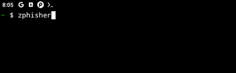
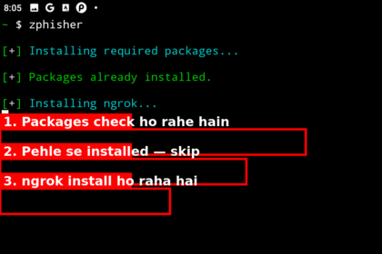
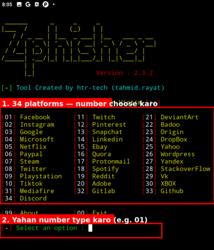
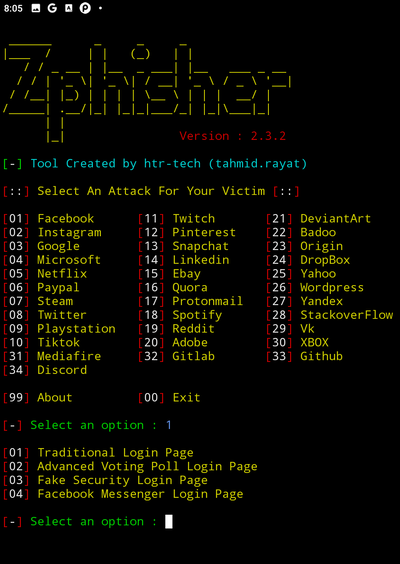
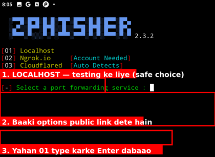
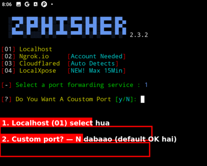
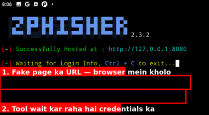
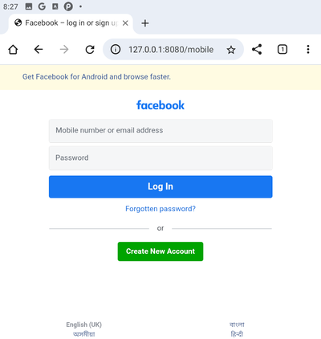
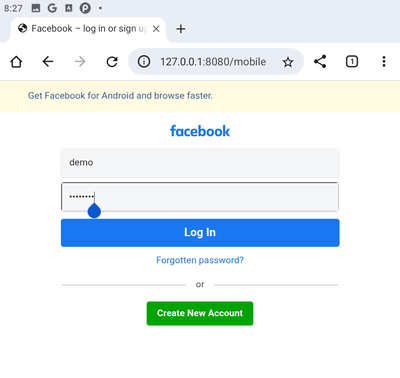
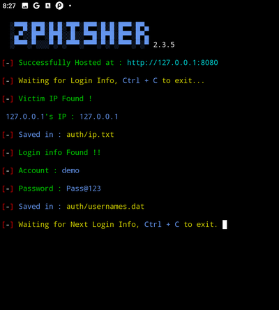

# Chapter 8 — Famous Hacking Techniques Aur Tools
### By TWH (Afsar Ali) | Technical White Hat

---

## 📚 Table of Contents

| # | Topic | Jump |
|---|---|---|
| 8.1 | Phishing Technique Aur Zphisher Tool — Termux + Kali | [➜ Jao](#-topic-81--phishing-technique-aur-zphisher-tool--termux--kali) |

---
---

**badhai ho guys** — Chapter 1 se lekar Chapter 7 tak jo bhi seekha — computer, networking, Linux, Kali, Termux, aur tool/programming language ka concept — woh saari **taiyaari** thi. asli maza ab shuru hota hai.

is chapter mein hum har topic mein **ek famous real-world hacking technique** lenge, usko poori tarah samjhenge (kaam kaise karti hai, kyun kaam karti hai), aur uske saath jo **actual tool** use hota hai — usko **Termux aur Kali Linux dono mein install** karna aur **use karna** seekhenge.

pehla topic — sabse common aur sabse zyada real-life mein hone wala attack — **Phishing.**

⚠️ **ek zaroori baat shuru mein hi clear kar dete hain:** yeh chapter tumhe yeh tool **sirf seekhne aur samajhne ke liye** dikha raha hai — taaki tum jaan sako yeh attack kaise hota hai aur **khud ko/logo ko bacha sako.** kisi bhi real insaan pe, uski permission ke bina, yeh tool use karna **illegal** hai. is course mein hum sirf apne khud ke test account/apne banaye demo pe practice karenge.

chalo, welcome karte hain **Chapter 8** mein.

---
---

## 📌 Topic 8.1 — Phishing Technique Aur Zphisher Tool — Termux + Kali

---

### Phishing kya hota hai — seedhi baat

> **Phishing ek aisi technique hai jisme hacker ek asli website (jaise Facebook, Instagram, Gmail) ki nakli (fake) copy banata hai, aur victim ko woh nakli link bhejta hai. victim jab us fake page pe apna email/password daalta hai, woh details seedha hacker ke paas chali jaati hain — asli website pe kuch hota hi nahi.**

yeh naam "**fishing**" (machli pakadna) se aaya hai — jaise machhli pakadne wala ek chaara (bait) daalta hai aur machhli khud aakar phas jaati hai, waise hi hacker ek "chaara" (fake login page ka link) daalta hai aur victim khud apni details de deta hai.

---

### phishing itni famous/dangerous kyun hai

kyunki isme **koi technical hacking nahi hoti** — na password crack karna padta hai, na system mein ghusna padta hai. hacker sirf ek **insaan ko dhoka** deta hai (ise "**Social Engineering**" kehte hain — insaan ki galti/vishwaas ka fayda uthana). isiliye duniya mein sabse zyada hacking cases **phishing se hi shuru hote hain** — bade se bade company hack bhi kabhi kabhi ek employee ke phishing email pe click karne se shuru hue hain.

---

### ek real-life example se samjho

socho tumhe ek message aata hai: *"tumhara Instagram account 24 ghante mein delete ho jaayega, abhi login karke confirm karo"* — saath mein ek link hai. woh link dikhta hai bilkul Instagram jaisa (logo, colors, layout sab same), lekin **URL** dhyaan se dekho toh woh Instagram.com nahi hota — kuch alag hota hai.

agar koi jaldi mein, bina URL check kiye, apna username-password daal de — woh details seedha attacker ke paas chali jaati hain, aur asli Instagram pe kabhi kuch hua hi nahi.

**yehi hai phishing — nakli page, asli jaisi dikhne wali cheez, aur ek jaldi mein liya gaya galat decision.**

---

### iske liye tool ka naam hai — Zphisher

ab is technique ko practically samajhne ke liye (sirf apne demo pe, khud pe test karne ke liye) hum ek famous open-source tool use karenge jiska naam hai — **Zphisher**.

> Zphisher ek **automated phishing tool** hai jo popular websites (Facebook, Instagram, Google, etc.) ke **ready-made fake login pages** already bana ke rakhta hai — tumhe khud page design nahi karna padta, tool khud sab kar deta hai.

yeh tool **Bash script** mein likha gaya hai (Topic 7.2 yaad hai? — yehi wajah hai ki yeh Termux aur Kali dono mein bina kisi jhanjhat ke chal jaata hai, kyunki dono jagah Bash already available hai).

---

### Zphisher install karna — Termux mein

sabse pehle, `git` install karna padega — kyunki isi ke through hum GitHub se Zphisher ka code copy (clone) karenge:

```bash
pkg install git
```

`git` install hone ke baad, yeh commands step-by-step chalao:

```bash
git clone --depth=1 https://github.com/htr-tech/zphisher.git
cd zphisher
bash zphisher.sh
```

- pehli command (`pkg install git`) — `git` naam ka tool install karti hai, jiske bina GitHub se code clone nahi kar sakte.
- doosri command (`git clone ...`) — Zphisher ka poora code GitHub se tumhare Termux mein copy kar leti hai.
- teesri command (`cd zphisher`) — usi folder ke andar jaati hai jo clone hua.
- chauthi command (`bash zphisher.sh`) — tool ko chalati hai. **pehli baar chalate waqt** yeh khud-ba-khud zaroori dependencies (`curl`, `php`) install kar lega.

yahan dekho — `bash zphisher.sh` chalane ke baad terminal kuch aisa dikhta hai:



aur pehli baar chalane pe yeh khud-ba-khud packages install karna shuru kar deta hai:



---

### Zphisher install karna — Kali Linux mein

Kali Linux mein bhi bilkul wahi tarika follow karenge — pehle check/install `git`, phir GitHub se clone:

```bash
sudo apt install git
```

(zyada tar Kali Linux mein `git` **already pre-installed** aata hai, lekin upar wali command chala kar confirm/install kar lo — agar already hoga toh yeh "already the newest version" bol dega.)

uske baad wahi commands:

```bash
git clone --depth=1 https://github.com/htr-tech/zphisher.git
cd zphisher
bash zphisher.sh
```

- pehli command — Zphisher ka poora code GitHub se tumhare Kali mein copy kar leti hai.
- doosri command — usi folder ke andar jaati hai jo clone hua.
- teesri command — tool ko chalati hai. **pehli baar chalate waqt** yeh khud-ba-khud zaroori dependencies (`curl`, `php`) install kar lega.

> **dhyaan do** — Termux aur Kali dono mein install karne ka tarika ab **bilkul same** hai — `git install karo → git clone karo → cd zphisher → bash zphisher.sh`. bas pehli command (git install karne ka tarika) alag hai (`pkg install git` vs `sudo apt install git`), baaki sab identical hai.

---

### Zphisher use kaise karna hai — step by step

install hone ke baad, jab tum `zphisher` (Termux) ya `bash zphisher.sh` (Kali) chalaoge, ek **menu screen** khulegi:

**Step 1 — website choose karo**

menu mein numbers ke saath list dikhegi — Facebook, Instagram, Google se lekar 34 platforms tak. jis website ka fake page banana hai, uska number type karo.



**Step 2 — login page ka type choose karo**

kuch websites ke liye multiple page-styles milte hain. jaise Facebook choose kiya toh yeh options aate hain:



**Step 3 — tunneling option choose karo**

yeh sabse important step hai. tumhara fake page abhi tumhare hi phone/laptop pe chal raha hai (localhost pe) — usko accessible banane ke liye tunneling option choose karna padta hai:



   - **[01] Localhost** — sirf tumhare khud ke device pe kaam karega (demo/testing ke liye best — koi bahar nahi jaata)
   - **[02] Ngrok.io** — public link banata hai, lekin account chahiye
   - **[03] Cloudflared** — public link banata hai, auto detect karta hai
   - **[04] LocalXpose** — naya option, max 15 min ka link deta hai

Localhost choose karne ke baad yeh custom port ke baare mein poochta hai — bas **N** press karo (default port theek hai):



**Step 4 — link generate hoga**

sab set hone ke baad terminal kuch aisa dikhta hai — tool hosted ho jaata hai aur login info ka wait karta hai:



**Step 5 — victim ka page kholna aur credentials capture hona**

ab jo link generate hua woh browser mein kholo — aisa dikhega:



> dhyaan se dekho upar — browser ke **address bar** mein `127.0.0.1:8080/mobile` likha hai — `facebook.com` nahi. page ke andar bilkul asli Facebook jaisa dikhta hai — logo, colors, fields sab same. **yahi phishing ka poora kaam hai** — bahar se pakadna mushkil, andar se ek dum khali.

ab us page pe koi bhi details daalo (test ke liye sirf fake details — jaise `demo` aur `Pass@123`):



**Log In** button dabate hi — woh details seedha terminal pe aa jaati hain:



> terminal mein dekho — `[-] Login info Found !!` aaya, phir neeche `Account : demo` aur `Password : Pass@123` clearly dikh raha hai. victim ne abhi abhi apna password diya — aur usse pata bhi nahi chala. asli Facebook pe kuch hua hi nahi.

---

### zaroori disclaimer — dobara, kyunki yeh critical hai

> **is tool ka use sirf apne khud ke banaye demo account pe, apne khud ke device pe, ya kisi ki likhi hui permission ke saath hi karna hai.** kisi bhi real insaan ko, uski jaankari/permission ke bina, fake link bhejna **cyber crime** hai — chahe woh "sirf mazak" ke liye ho. is course ka maksad hai tumhe yeh sikhana ki **attack kaise hota hai, taaki tum khud ko aur doosron ko bacha sako** — attack karna nahi.

---

### ek line mein

> **Phishing ek fake login page bana ke, victim ko dhoka dekar uske username/password churane ki technique hai — bina koi technical hacking kiye, sirf insaan ke vishwaas ka fayda uthaya jaata hai. Zphisher ek Bash-based tool hai jo yeh fake pages ready-made deta hai — Termux mein `pkg install zphisher` se aur Kali mein GitHub clone karke install hota hai — hamesha sirf apni permission wale demo pe use karna hai.**

---

## 🧠 MCQ Set — Topic 8.1

---

**Q1.** Phishing technique mein hacker asal mein kya karta hai?

- A) victim ke phone ka password directly crack karta hai
- B) ek asli website ki nakli copy (fake login page) banata hai aur victim ko dhoka dekar uski details le leta hai
- C) victim ke phone ka hardware kharab karta hai
- D) internet ki speed slow kar deta hai

✅ **Sahi Jawab: B**
> phishing mein koi technical hacking nahi hoti — sirf ek fake page banake insaan ko dhoka diya jaata hai.

---

**Q2.** phishing ko "Social Engineering" ka example kyun kaha jaata hai?

- A) kyunki ismein computer hardware use hota hai
- B) kyunki ismein internet ka use nahi hota
- C) kyunki ismein technical hacking ke bajaye insaan ke vishwaas/galti ka fayda uthaya jaata hai
- D) kyunki yeh sirf social media companies use karti hain

✅ **Sahi Jawab: C**
> Social Engineering matlab insaan ko manipulate karke kaam nikalna — phishing isi ka ek example hai.

---

**Q3.** Zphisher tool basically kya karta hai?

- A) victim ke phone ka data delete karta hai
- B) popular websites ke ready-made fake login pages provide karta hai, jinka link victim ko bheja jaata hai
- C) sirf internet speed test karta hai
- D) sirf photos edit karta hai

✅ **Sahi Jawab: B**
> Zphisher automated tool hai jo already-bane fake login pages deta hai, taaki manually design na karna pade.

---

**Q4.** Zphisher Termux mein kaise install hota hai?

- A) sirf `pkg install zphisher` se, seedha
- B) pehle `pkg install git` se git install karo, phir `git clone` se code download karke `bash zphisher.sh` chalao
- C) Play Store se download karke
- D) Termux mein yeh tool chal hi nahi sakta

✅ **Sahi Jawab: B**
> Termux mein pehle `git` install karna padta hai, uske baad GitHub se `git clone` karke, folder ke andar jaakar `bash zphisher.sh` se chalate hain.

---

**Q5.** Kali Linux mein Zphisher install karne ka tarika, Termux ke tarike se kaisa hai?

- A) bilkul alag hai, koi similarity nahi
- B) bilkul same hai — git install karo, git clone karo, `cd zphisher`, phir `bash zphisher.sh` — bas git install karne ki command (`pkg` vs `apt`) alag hai
- C) Kali mein sirf `apt install zphisher` se ho jaata hai
- D) Kali mein yeh tool chal hi nahi sakta

✅ **Sahi Jawab: B**
> dono jagah process same hai — git install → git clone → cd zphisher → bash zphisher.sh. sirf git install karne ki command Termux (`pkg`) aur Kali (`apt`) mein alag hai.

---

**Q6.** Zphisher chalane ke baad "tunneling option" (jaise Localhost ya Cloudflared) kis kaam ke liye poochta hai?

- A) sirf tool ka color theme choose karne ke liye
- B) fake page ka link generate karne ke liye — taaki woh link kahin se khola ja sake
- C) phone ki battery bachane ke liye
- D) tool delete karne ke liye

✅ **Sahi Jawab: B**
> tunneling option decide karta hai fake page kis tarah accessible hoga — sirf local network mein (Localhost) ya kahin se bhi (Cloudflared).

---

**Q7.** jab victim fake page pe apna username/password daal deta hai, toh woh details kahan jaati hain?

- A) asli website (jaise real Instagram) ke server pe
- B) seedha attacker ki terminal screen pe dikh jaati hain
- C) kahin nahi jaati, delete ho jaati hain
- D) sirf victim ke apne phone mein save hoti hain

✅ **Sahi Jawab: B**
> Zphisher chalane wale ki terminal pe hi entered credentials turant dikh jaate hain, asli website ka koi role nahi hota.

---

**Q8.** is topic mein bataye gaye rule ke hisaab se, Zphisher jaisa tool kab use karna sahi hai?

- A) kisi bhi random insaan pe, bina bataye, "mazak" ke liye
- B) sirf apne khud ke test account/device pe, ya jiski likhi permission ho, seekhne ke maksad se
- C) sirf apne dost ke account pe uske bina bataye
- D) kabhi bhi, kahin bhi, kisi pe bhi

✅ **Sahi Jawab: B**
> permission ke bina kisi real insaan pe use karna cyber crime hai — is course ka maksad hai defend karna seekhna, attack karna nahi.

---

**Q9.** Zphisher tool kis programming language (script) mein likha gaya hai?

- A) Python
- B) Java
- C) Bash
- D) C++

✅ **Sahi Jawab: C**
> Zphisher ek Bash script hai — isiliye Termux aur Kali dono mein bina extra setup ke chal jaata hai, kyunki dono jagah Bash already available hoti hai.

---

**Q10.** phishing attack mein sabse pehle kaunsi cheez victim ko dhoka dene ka kaam karti hai?

- A) victim ka phone hack ho jaata hai seedha
- B) ek nakli login page jo bilkul asli website jaisi dikhti hai
- C) virus send kiya jaata hai email ke zariye
- D) victim ka internet band kar diya jaata hai

✅ **Sahi Jawab: B**
> phishing ki puri taakat uski visual similarity mein hai — nakli page itna asli dikhta hai ki victim bina sooche apna password daal deta hai.

---

**Q11.** Zphisher mein "Cloudflared" tunneling option ka kya kaam hota hai?

- A) tool ki speed badhata hai
- B) tool uninstall karta hai
- C) ek public link banata hai jo internet pe kahin se bhi access kiya ja sake
- D) sirf local Wi-Fi ke andar kaam karta hai

✅ **Sahi Jawab: C**
> Cloudflared ek public accessible link generate karta hai — taaki fake page sirf tumhare network tak limited na rahe.

---

**Q12.** "phishing" naam kahan se aaya hai?

- A) ek hacker ke naam se
- B) "fishing" (machli pakadna) se — jaise machhliwala chaara daalke machhli phasata hai, hacker fake link se victim ko phasata hai
- C) ek virus ke naam se
- D) "phone hacking" ke short form se

✅ **Sahi Jawab: B**
> naam bilkul fishing se inspired hai — bait (chaara) daalo, victim khud aa ke phas jaaye.

---

**Q13.** agar koi keh raha ho ki "main sirf apne dost ka account test ke liye phish karunga, usse bata bhi dunga baad mein" — yeh sahi hai ya galat?

- A) bilkul sahi — dost hai toh koi baat nahi
- B) galat — permission pehle leni hoti hai, baad mein batana legal nahi hota
- C) sahi — agar baad mein bata do toh crime nahi
- D) sahi — sirf strangers pe use karna galat hota hai

✅ **Sahi Jawab: B**
> permission likhit mein pehle chahiye — "baad mein bataunga" wali baat legally koi value nahi rakhti, yeh crime hi hai.

---

**Q14.** Zphisher use karte waqt website choose karne ke baad kaunsa step aata hai?

- A) seedha link generate ho jaata hai
- B) tool band ho jaata hai
- C) login page ka type/style choose karna padta hai
- D) phone restart karna padta hai

✅ **Sahi Jawab: C**
> website choose karne ke baad, tool poochta hai kaunsa page style chahiye (jaise "normal login" ya koi special variant) — phir tunneling choose hoti hai, phir link generate hota hai.

---

**Q15.** phishing attacks itne common kyun hain — technical hacking ki jagah?

- A) kyunki yeh free hai
- B) kyunki ismein koi coding nahi chahiye aur insaan ki psychology exploit hoti hai — yeh sabse aasaan aur effective attack vector hai
- C) kyunki police track nahi kar sakti
- D) kyunki yeh sirf mobile pe kaam karta hai

✅ **Sahi Jawab: B**
> system hack karna mushkil hota hai — insaan ko dhoka dena zyada aasaan. isiliye duniya ki most hacking incidents phishing se hi shuru hoti hain.

---

## 🛠️ Hands-On Task — Topic 8.1

**Task: Apne Khud Ke Liye Ek Phishing Demo Setup Karo — Aur Khud Hi Usse "Bachna" Seekho**

Yeh task do histon mein hai — pehle attacker ki taraf se dekho (apne test pe), phir defender ki taraf se.

---

**Hissa 1 — Phishing Demo Karo (sirf apne test account pe)**

1. **Termux ya Kali mein Zphisher install karo** — upar wale steps follow karo.
2. Tool chalao: `bash zphisher.sh`
3. Facebook choose karo (option **01**), phir **Traditional Login Page** (option **01**).
4. Tunneling option mein **Localhost** (option **01**) choose karo — link sirf tumhare apne device pe hi kaam karega, koi bahar nahi jaayega. Custom port ke liye **N** press karo.
5. Jo link generate hua (`http://127.0.0.1:8080`), woh apne phone ke browser mein kholo — kuch aisa dikhega:


dekho — bilkul asli Facebook jaisa lag raha hai, lekin **URL bar** mein `127.0.0.1:8080` likha hai — facebook.com nahi! Yahi sabse bada clue hai phishing pakadne ka.

6. **Real account bilkul mat use karna** — koi bhi fake details daalo jaise `demo` / `Pass@123`:


7. Ab terminal pe wapas jao — details turant wahan capture ho gayi hain:


> **Yahi phishing hoti hai.** Tumne khud apna ek "attack" dekha — bina koi real account use kiye, bina kisi aur ko involve kiye.

---

**Hissa 2 — Ab Defender Bano (yahi asli lesson hai)**

Woh same fake page kholo jo tune abhi banaya — aur dhyaan se dekho:

1. **URL check karo** — kya woh sach mein instagram.com hai? ya kuch aur hai (jaise 127.0.0.1:8080 ya koi random domain)?
2. **HTTPS lock icon dekho** — kya hai? genuine sites pe hota hai.
3. **Page ka source dekho** — browser mein Ctrl+U — dikhaai dega yeh local file hai ya server se aa raha hai.

**Yeh 3 cheezein real life mein kisi bhi link pe check karo — phishing se kabhi nahi fasoge.**

---

> 💡 **Tip:** Duniya ke 90% phishing attacks tab kaam karte hain jab victim jaldi mein hota hai ya daraya gaya hota hai ("account delete ho jaayega!"). Jab bhi aisa koi message aaye — **ruko, URL dekho, tab decide karo.** Hacker ki sabse badi dushman tumhari **slow, deliberate reaction** hai.

---

## 🎉 Ek Pal Ruko — Tumne Abhi Apni Zindagi Ka Pehla "Hack" Kiya Hai

terminal mein woh line dekhi?

```
[-] Login info Found !!
[-] Account : demo
[-] Password : Pass@123
```

woh tumne kiya. khud apne haath se. pehli baar.

yeh feeling — jab pehli baar koi cheez kaam karti hai jo tumne socha tha sirf movies mein hoti hai — **yeh feeling hamesha yaad rehti hai.** pehla hack hamesha special hota hai. chahe woh sirf ek demo account pe ho, chahe sirf localhost pe — koi farq nahi padta. tumne kiya. aur yahi kaafi hai aaj ke liye.

toh ek second ke liye ruko. mehsoos karo. **badhai ho.**

---

### lekin ek zaroori baat — seedhi aur honest

ab jo main kehne wala hun woh sunna bahut zaroori hai —

> **phishing hacking nahi hai.**

haan, tumne abhi jo kiya — woh ek real attack technique hai, duniya mein sabse zyada hone wali. lekin agar koi tumse pooche "kya tum hacker ho?" — toh sirf is ek cheez ko karke "haan" bolna sahi nahi hoga.

kyun?

kyunki phishing mein tumne **koi system hack nahi kiya.** tumne koi code nahi likha. koi vulnerability nahi dhundhi. koi firewall bypass nahi ki. tumne sirf ek **insaan ko dhoka dene ki technique** dekhi — jo ki ethical hacking ki duniya ka ek bahut chota sa hissa hai.

socho aise — agar hacking ek poori university hai, toh phishing sirf **orientation day** hai. pehla din. class abhi shuru bhi nahi hui.

asli hacking mein hota hai:

- systems ki vulnerabilities dhundhna aur exploit karna
- networks ko samajhna aur unke andar ghusna
- code likhna — exploits, scripts, tools
- forensics — evidence dhundhna ya mitana
- privilege escalation — ek baar andar gaye toh aur andar jaana
- aur bahut kuch — jo aage ke topics mein aayega

---

### toh phir yeh sab kyun seekha?

kyunki **har badi cheez ek chote se shuru hoti hai.**

duniya ke sabse bade hackers ne bhi kabhi pehli baar kuch chota kiya tha — aur us moment ne unhe yaad dilaya ki yeh field kitni powerful hai, kitni interesting hai, aur yahan kitna kuch seekhna baaki hai.

tumhara woh moment abhi tha.

is topic ne tumhe ek cheez di jo books mein nahi milti — **hands-on experience ka pehla zing.** woh curiosity jo ab jagee hai, woh energy jo feel ho rahi hai — **isi ko sambhal ke rakho.** yahi tumhara asli hacking ka fuel hai.

safar abhi shuru hua hai. aage bahut kuch hai. chalo badhte hain. 🚀

---

```
════════════════════════════════════════════════════════
   ✅  TOPIC 8.1 COMPLETE — PHISHING AUR ZPHISHER
   ⬇️  Neeche hai Topic 8.2
════════════════════════════════════════════════════════
```

---
